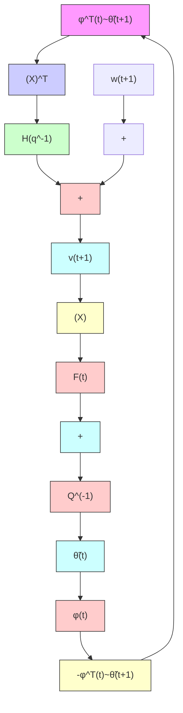

flowchart

Fig. 4.1 Equivalent feedback representation in the presence of stochastic disturbances, (a) recursive least squares, (b) general case

$$\mathbf {E} \left\{\phi (t) w (t + 1) \right\} = 0 \tag {4.14}$$

i.e., the observation vector and the image of the stochastic disturbance in the adaptation error equation should be uncorrelated. This observation is used in an averaging method for the analysis of PAA in a stochastic environment.

A second answer, using the conditional probabilities, takes the form:

$$\mathbf {E} \left\{F (t) \phi (t) w (t + 1) \right\} = \mathbf {E} \left\{F (t) \phi (t) \right\} \mathbf {E} \left\{w (t + 1) / \mathcal {F} _ {t} \right\} = 0 \tag {4.15}$$

where $\mathcal { F } _ { t }$ is the collections of all observations and their combinations up to and including t. Since ${ \bf E } \{ F ( t ) \phi ( t ) \} \ne 0$ , one concludes that a condition for getting unbiased estimates is that:

$$\mathbf {E} \left\{w (t + 1) / \mathcal {F} _ {t} \right\} = 0 \tag {4.16}$$

which means that the image of the disturbance in the equation of the adaptation error should be uncorrelated with the past observations. This allows to characterize w(t + 1) as a martingale difference sequence leading to an analysis method exploiting the properties of martingale sequences.
