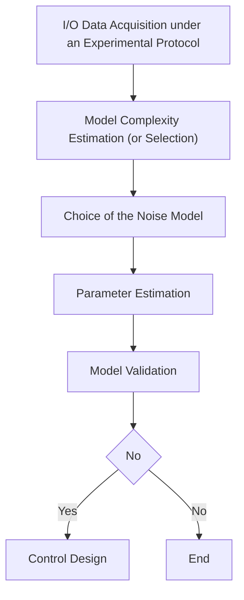
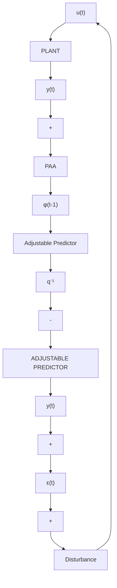

Fig. 5.1 The identification methodology   

flowchart

It is important to emphasize that no one single plant + disturbance structure exists that can describe all the situations encountered in practice. Furthermore, there is no parameter estimation algorithm that may be used with all possible plant + disturbance structures such that the estimated parameters are always unbiased. Furthermore, due to the lack of a priori information, the input-output data acquisition protocol may be initially inappropriate.

All these causes may lead to identified models which do not pass the validation test, and therefore the identification should be viewed as an iterative process as illustrated in Fig. 5.1. With respect to off-line parameter estimation techniques, the use of the recursive parameter estimation techniques offer three main advantages:

(a) An estimation of the model of the system can be obtained as the system evolves.   
(b) The on-line estimation model contains all the information provided by the past input-output data. Therefore one achieves a significant data compression.   
(c) Without major changes (just some choices in updating the adaptation gain ) one can follow the evolution of slowly time-varying systems.

It is also important to mention that the performance of these recursive algorithms makes them a competitive alternative to the off-line identification algorithm.

To keep the continuity of the text we will first discuss the recursive parameter estimation techniques and the model validation techniques. We will then go on to discuss the design of the input-output data acquisition protocol and the problem of model structure selection (estimation) which, in our case, concerns the selection (estimation) of the orders of the various polynomials and of the delay used in the discrete-time model of the system.

Fig. 5.2 Structure of the recursive identification methods   

flowchart

