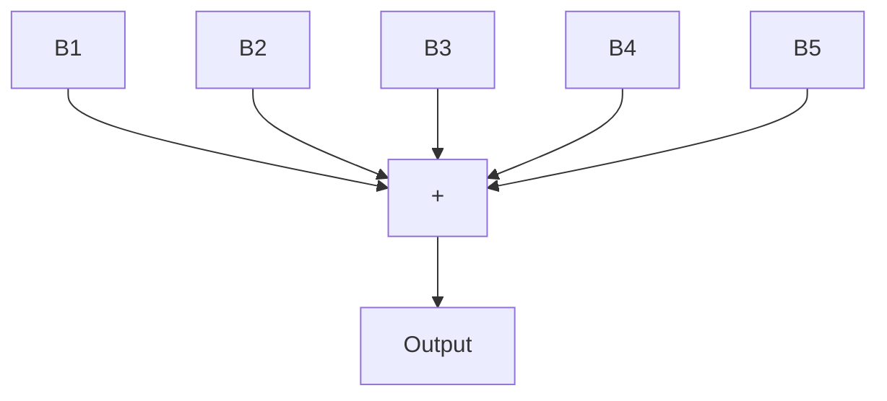

# 5.7.1 Pseudo Random Binary Sequences (PRBS)

Pseudo random binary sequences are sequences of rectangular pulses, modulated in width, that approximate a discrete-time white noise and thus have a spectral content rich in frequencies. They owe their name pseudo random to the fact that they are characterized by a sequence length within which the variations in pulse width vary randomly, but that over a large time horizon, they are periodic, the period being defined by the length of the sequence. In the practice of system identification, one generally uses just one complete sequence and we should examine the properties of such a sequence.

Fig. 5.3 Generation of a PRBS of length $2 ^ { 5 } - 1 = 3 1$ sampling periods   

flowchart

（ summation modulo 2 )

Table 5.3 Generation of maximum length PRBS

<table><tr><td>Number of cellsN</td><td>Sequence length $L = 2^{N} - 1$ </td><td>Bits added $B_{i}$  and  $B_{j}$ </td></tr><tr><td>2</td><td>3</td><td>1 and 2</td></tr><tr><td>3</td><td>7</td><td>1 and 3</td></tr><tr><td>4</td><td>15</td><td>3 and 4</td></tr><tr><td>5</td><td>31</td><td>3 and 5</td></tr><tr><td>6</td><td>63</td><td>5 and 6</td></tr><tr><td>7</td><td>127</td><td>4 and 7</td></tr><tr><td>8</td><td>255</td><td>2, 3, 4 and 8</td></tr><tr><td>9</td><td>511</td><td>5 and 9</td></tr><tr><td>10</td><td>1023</td><td>7 and 10</td></tr></table>

The PRBS are generated by means of shift registers with feedback (implemented in hardware or software).7 The maximum length of a sequence is $2 ^ { N } - 1$ , in which N is the number of cells of the shift register. Figure 5.3 presents the generation of a PRBS of length $3 1 = 2 ^ { 5 } - 1$ obtained by means of a 5-cells shift register.
