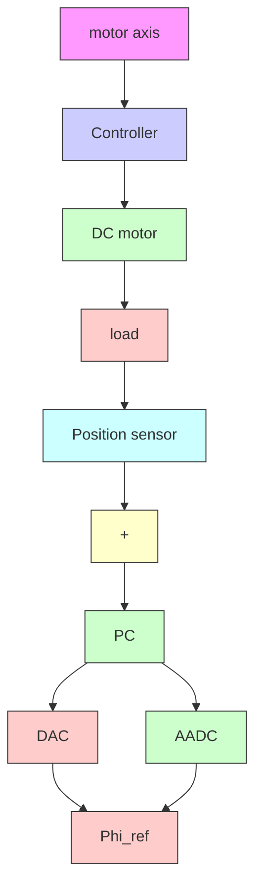

Fig. 5.8 The flexible transmission   

flowchart

```mermaid
graph TD
    A["motor axis"] --> B["Controller"]
    B --> C["DC motor"]
    C --> D["load"]
    D --> E["Position sensor"]
    E --> F["+"]
    F --> G["PC"]
    G --> H["DAC"]
    G --> I["AADC"]
    H --> J["Phi_ref"]
    I --> J
    style A fill:#f9f,stroke:#333
    style B fill:#ccf,stroke:#333
    style C fill:#cfc,stroke:#333
    style D fill:#fcc,stroke:#333
    style E fill:#cff,stroke:#333
    style F fill:#ffc,stroke:#333
    style G fill:#cfc,stroke:#333
    style H fill:#fcc,stroke:#333
    style I fill:#cfc,stroke:#333
    style J fill:#fcc,stroke:#333
```

