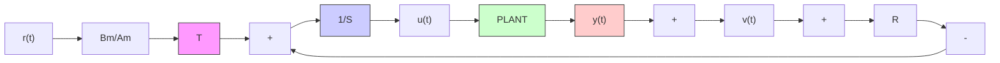

# 7.2 Canonical Form for Digital Controllers

It is assumed that the discretized plant to be controlled is described by the input– output model:

$$A (q ^ {- 1}) y (t) = q ^ {- d} B (q ^ {- 1}) u (t) + A (q ^ {- 1}) v (t) \tag {7.1}$$

where $y ( t )$ is the output, $u ( t )$ is the input and $v ( t )$ the disturbance added to the output (or more precisely an image of the disturbance).

A general (canonical) form of a two-degree of freedom digital controller is given by the equation:

$$S (q ^ {- 1}) u (t) + R (q ^ {- 1}) y (t) = T (q ^ {- 1}) y ^ {\star} (t + d + 1) \tag {7.2}$$

where $y ^ { \star } ( t + d + 1 )$ represents the desired tracking trajectory given with $d + 1$ steps in advance which is either stored in the computer or generated from the reference signal $r ( t )$ via a tracking reference model

$$y ^ {\star} (t + d + 1) = \frac {B _ {m} \left(q ^ {- 1}\right)}{A _ {m} \left(q ^ {- 1}\right)} r (t) \tag {7.3}$$

flowchart

Fig. 7.3 Control loop with RST digital controller

(with $B _ { m } ( q ^ { - 1 } ) = b _ { m 0 } + b _ { m 1 } q ^ { - 1 } + \cdot \cdot \cdot )$ and $A _ { m } ( q ^ { - 1 } )$ ) a monic polynomial. The corresponding block diagram is shown in Fig. 7.3.

The controller of (7.2) is termed the RST controller and its two-degree of freedom capabilities come from the fact that the regulation objectives are assured by the R-S part of the controller and the tracking objectives are assured by an appropriate design of the T polynomial.

On the basis of (7.1) and (7.2) one can define several transfer operators defining the relationship between on the one hand the reference trajectory and the disturbance and on the other hand the output and the input of the plant. We first observe that the closed-loop poles are defined by the equation:

$$P (q ^ {- 1}) = A (q ^ {- 1}) S (q ^ {- 1}) + q ^ {- d - 1} B ^ {\star} (q ^ {- 1}) R (q ^ {- 1}) \tag {7.4}$$

and eliminating u(t) between (7.1) and (7.2) one gets:

$$y (t) = H _ {C L} (q ^ {- 1}) y ^ {\star} (t + d + 1) + S _ {y p} (q ^ {- 1}) v (t) \tag {7.5}$$

where:
