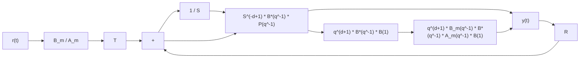

# 7.3 Pole Placement

The remaining design element of the controller is the polynomial $T ( q ^ { - 1 } )$ . The transfer function from the desired reference trajectory to the output is:

$$H _ {C L} (q ^ {- 1}) = \frac {q ^ {- d - 1} T (q ^ {- 1}) B ^ {\star} (q ^ {- 1})}{P _ {D} (q ^ {- 1}) P _ {F} (q ^ {- 1})} \tag {7.35}$$

Several situations may occur.

(a) The desired tracking dynamic $A _ { m } ( q ^ { - 1 } )$ does not contain any of the poles of the closed loop.

(b) The desired tracking dynamic $A _ { m } ( q ^ { - 1 } )$ ) contains some of the poles of $P ( q ^ { - 1 } )$ denoted by $P _ { 0 } ( q ^ { - 1 } )$ .

(c) The tracking and regulation dynamics are the same.

In the case (a) $H _ { C L } ( q ^ { - 1 } )$ should have a steady stage gain of 1 and $T ( q ^ { - 1 ) }$ should compensate the closed-loop poles i.e.,

$$T (q ^ {- 1}) = \beta P (q ^ {- 1}) \tag {7.36}$$

where

$$\beta = \frac {1}{B ^ {\star} (1)} \tag {7.37}$$

The resulting transfer function from the reference to the output is:

$$H (q ^ {- 1}) = \frac {q ^ {- d - 1} B _ {m} (q ^ {- 1}) B ^ {*} (q ^ {- 1})}{A _ {m} (q ^ {- 1}) B ^ {*} (1)} \tag {7.38}$$

In the case (b) assuming that

$$A _ {m} (q ^ {- 1}) = A _ {m} ^ {\prime} (q ^ {- 1}) P _ {0} (q ^ {- 1}) \tag {7.39}$$

and

$$P (q ^ {- 1}) = P ^ {\prime} (q ^ {- 1}) P _ {0} (q ^ {- 1}) \tag {7.40}$$

the tracking reference model will be

$$H _ {m} (q ^ {- 1}) = \frac {B _ {m} ^ {\prime} (q ^ {- 1})}{A _ {m} ^ {\prime} (q ^ {- 1})} \tag {7.41}T (q ^ {- 1}) = \beta P ^ {\prime} (q ^ {- 1}) \tag {7.42}$$

The resulting transfer function from the reference to the output is:

$$H (q ^ {- 1}) = \frac {q ^ {- d - 1} B _ {m} (q ^ {- 1}) B ^ {*} (q ^ {- 1})}{A _ {m} ^ {\prime} (q ^ {- 1}) P _ {0} (q ^ {- 1}) B ^ {*} (1)} \tag {7.43}$$

In the case (c)

$$H _ {m} (q ^ {- 1}) = 1 \tag {7.44}T (q ^ {- 1}) = \beta P (1) \tag {7.45}$$

If S contains an integrator then P (1) = B(1)R(1) and therefore:

$$T (q ^ {- 1}) = R (1) \tag {7.46}$$

Fig. 7.4 Pole placement scheme for tracking and regulation   

flowchart

The resulting transfer function from the reference to the output is in this case:

$$H (q ^ {- 1}) = \frac {q ^ {- d - 1} B ^ {\star} (q ^ {- 1}) P (1)}{P (q ^ {- 1}) B ^ {\star} (1)} \tag {7.47}$$

Note that better tracking performances can be obtained if the stable zeros of $B ^ { \star } ( q ^ { - 1 } )$ are compensated and the unstable ones are partially compensated by using the stable reciprocal inverse (Tsypkin 1993). However, this requires a very good knowledge of the coefficient of $B ^ { \star } ( q ^ { - 1 } )$ ).

The complete block diagram of the pole placement for the case (a) (different dynamics for tracking and regulation) is shown in Fig. 7.4.
