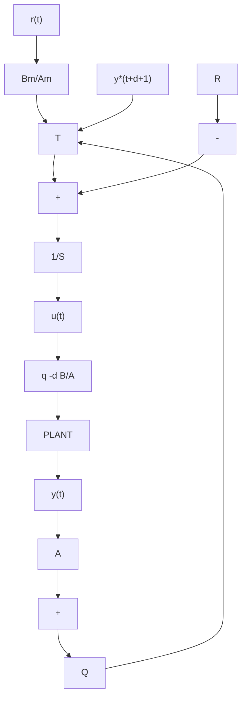

# Remarks

• The controller $R _ { 0 } , ~ S _ { 0 } , ~ T _ { 0 }$ correspond to the pole placement controller for the plant model (7.1) with $d = 0$ and with the desired closed-loop poles defined by $P _ { D } ( q ^ { - 1 } )$ .   
• The controller of (7.55) and (7.56) shows for ${ \cal P } _ { F } ( q ^ { - 1 } ) = 1$ that in order to control a system with delay using pole placement, one can use the controller for the case without delay by replacing the measured output $y ( t )$ by its d-step ahead prediction ${ \hat { y } } ( t + d | t )$ .   
• The introduction of the auxiliary poles corresponds to replacing the measured output or its prediction by a filtered prediction.   
• If (7.55) is replaced by:

$$S _ {0} (q ^ {- 1}) u (t) = - R _ {0} (q ^ {- 1}) \hat {y} (t + d | t) + T _ {0} (q ^ {- 1}) y ^ {\star} (t + d + 1) \tag {7.60}$$

The auxiliary poles $P _ { F } ( q ^ { - 1 } )$ can be interpreted as the poles of an observer since they are canceled in the input-output transfer function.

• Therefore implicitly an RST controller contains a predictor. Some of the closedloop poles (or all) can be interpreted as the predictor poles. Conversely all the non-zero poles can be considered as design poles and the predictor is a dead-beat predictor (i.e., all the poles are at the origin).

Proof From (7.1) and (7.55) one has:

$$
\begin{array}{l} A P _ {F} S _ {0} y (t + d + 1) = B ^ {\star} P _ {F} S _ {0} u (t) \\ = - B ^ {\star} R _ {0} P _ {F} \hat {y} (t + d | t) + B ^ {\star} P _ {F} T _ {0} y ^ {\star} (t + d + 1) \tag {7.61} \\ \end{array}
$$

and taking also into account (7.56) one has:

$$
\begin{array}{l} [ A P _ {F} S _ {0} + q ^ {- d - 1} B ^ {\star} R _ {0} F + q ^ {1} B ^ {\star} R _ {0} A E ] y (t + d + 1) \\ = B ^ {\star} P _ {F} T _ {0} y ^ {\star} (t + d + 1) \tag {7.62} \\ \end{array}
$$

flowchart

Fig. 7.6 Pole placement scheme using Youla-Kucera parameterization

But:

$$
\begin{array}{l} A P _ {F} S _ {0} + q ^ {- d - 1} B ^ {\star} R _ {0} F + q ^ {- 1} B ^ {\star} R _ {0} A E = A S _ {0} P _ {F} + q ^ {- 1} B ^ {\star} R _ {0} [ A E + q ^ {- d} F ] \\ = P _ {D} P _ {F} \tag {7.63} \\ \end{array}
$$

and one sees, taking into account the expression of $T _ { 0 }$ , that both closed-loop poles and the transfer operator from the reference to the output are the same. -
