# Another Time-Domain Interpretation

(M’Saad et al. 1986; Irving et al. 1986) We have seen that in the case of pole placement one has:

$$P (q ^ {- 1}) e _ {y} (t + d + 1) = 0; \quad t \geq 0 \tag {7.66}$$

where

$$e _ {y} (t + d + 1) = y (t + d + 1) - \beta B ^ {\star} (q ^ {- 1}) y ^ {\star} (t + d + 1) \tag {7.67}$$

```mermaid
graph TD
    A["y*(t+d+1)"] --> B["β"]
    B --> C["q-dB"]
    C --> D["+"]
    D --> E["O"]
    E --> F["R/S"]
    F --> G["HR/HS"]
    G --> H["+"]
    H --> I["u(t)"]
    I --> J["q-dB/A"]
    J --> K["y(t)"]
    K --> L["-"]
    L --> M["+"]
    M --> N["e_u"]
    N --> O["+"]
    O --> P["O"]
    P --> Q["-e_y"]
    Q --> R["O"]
    R --> S["+"]
    S --> T["O"]
    T --> U["-"]
    U --> V["+"]
    V --> W["O"]
    W --> X["+"]
    X --> Y["O"]
    Y --> Z["-"]
    Z --> AA["+"]
    AA --> AB["O"]
```

flowchart

Fig. 7.7 Equivalent pole placement scheme (partial state model reference control)

with

$$T (q ^ {- 1}) = \beta P (q ^ {- 1}) \tag {7.68}$$

Introducing this expression of $T ( q ^ { - 1 } )$ in (7.14) one gets

$$P (q ^ {- 1}) [ u (t) - \beta A (q ^ {- 1}) y ^ {\star} (t + d + 1) ] = P (q ^ {- 1}) e _ {u} (t) = 0 \tag {7.69}$$

where

$$e _ {u} (t) = u (t) - \beta A (q ^ {- 1}) y ^ {\star} (t + d + 1); \quad t > 0 \tag {7.70}$$

Therefore pole placement can be interpreted as forcing two performance indicators $e _ { y } ( t ) , e _ { u } ( t )$ to zero:

$$P (q ^ {- 1}) e _ {y} (t) = P (q ^ {- 1}) e _ {u} (t) = 0; \quad t > 0 \tag {7.71}$$

On the other hand taking into account the expression of T one gets:

$$S (q ^ {- 1}) u (t) = \left(A (q ^ {- 1}) S (q ^ {- 1}) + q ^ {- d - 1} B ^ {\star} (q ^ {- 1}) R (q ^ {- 1})\right) \beta y ^ {\star} (t + d + 1)- R (q ^ {- 1}) y (t) \tag {7.72}$$

or in other terms:

$$S (q ^ {- 1}) u (t) = - R (q ^ {- 1}) [ y (t) - B ^ {\star} (q ^ {- 1}) \beta y ^ {\star} (t) ]+ S (q ^ {- 1}) A (q ^ {- 1}) \beta y ^ {\star} (t + d + 1) \tag {7.73}$$

yielding:

$$u (t) = - \frac {R (q ^ {- 1})}{S (q ^ {- 1})} e _ {y} (t) + A (q ^ {- 1}) \beta y ^ {\star} (t + d + 1) \tag {7.74}$$

or

$$S (q ^ {- 1}) e _ {u} (t) + R (q ^ {- 1}) e _ {y} (t) = 0 \tag {7.75}$$

which leads to the equivalent pole placement scheme shown in Fig. 7.7 where instead of the polynomial T acting on the desired trajectory, one applies it in two different points through two polynomials which are those of the plant model. This means that whatever values are given to R and S the poles of the closed loop will be compensated from the reference. This equivalent scheme is called partial state model reference (PSMR) control (M’Saad et al. 1986).
