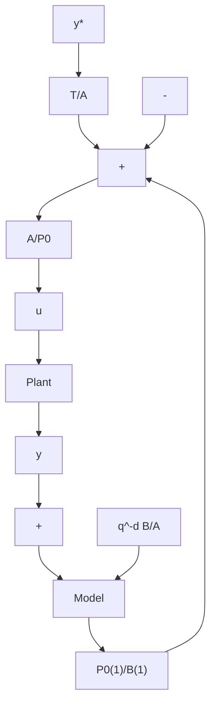

# Internal Model Control (IMC)

IMC corresponds to a pole placement characterized by the fact that the desired closed loop contains the poles of the plant assumed to be asymptotically stable i.e., the RST controller is the solution of:

$$
\begin{array}{l} A (q ^ {- 1}) S (q ^ {- 1}) + q ^ {- d} B (q ^ {- 1}) R (q ^ {- 1}) = A (q ^ {- 1}) P _ {D} (q ^ {- 1}) P _ {F} (q ^ {- 1}) \\ = A (q ^ {- 1}) P _ {0} (q ^ {- 1}) \tag {7.79} \\ \end{array}
$$

However, this implies that:

$$R (q ^ {- 1}) = A (q ^ {- 1}) R ^ {\prime} (q ^ {- 1}) \tag {7.80}$$

i.e., (7.79) is replaced by

$$S (q ^ {- 1}) + q ^ {- d} B (q ^ {- 1}) R ^ {\prime} (q ^ {- 1}) = P _ {0} (q ^ {- 1}) \tag {7.81}$$

and this allows the set of all controllers to be characterized as:

$$
\begin{array}{l} S (q ^ {- 1}) = P _ {0} (q ^ {- 1}) - q ^ {- d} B (q ^ {- 1}) Q (q ^ {- 1}) (7.82) \\ R ^ {\prime} (q ^ {- 1}) = Q (q ^ {- 1}) (7.83) \\ \end{array}
$$

where Q is a stable polynomial in $q ^ { - 1 }$ . The value of Q is determined if a constraint on $S ( q ^ { - 1 } )$ is imposed. For example if $S ( q ^ { - 1 } )$ ) contains an integrator S(1) = 0 and therefore

$$P _ {0} (1) - B (1) Q (1) = S (1) = 0 \tag {7.84}$$

One gets then:

$$Q = Q (1) = \frac {P _ {0} (1)}{B (1)} \tag {7.85}$$

Fig. 7.8 Equivalent pole placement scheme for $\mathsf { \tilde { P } } ( q ^ { - 1 } ) = A ( q ^ { - 1 } ) P _ { 0 } ( q ^ { - 1 } )$ (Internal Model Control)   

flowchart

as the simplest solution yielding:

$$S (q ^ {- 1}) = P _ {0} (q ^ {- 1}) - q ^ {- d} \frac {B (q ^ {- 1}) P _ {0} (1)}{B (1)} \tag {7.86}R (q ^ {- 1}) = A (q ^ {- 1}) \frac {P _ {0} (1)}{B (1)} \tag {7.87}$$

Note also that including $A ( q ^ { - 1 } )$ in the closed-loop poles the Diophantine equation is transformed in a polynomial division which has always a solution (see Sect. 7.4). Observes also that the controller equation takes the form:

$$S (q ^ {- 1}) u (t) = - R (q ^ {- 1}) y (t) + T (q ^ {- 1}) y ^ {\star} (t + d + 1)$$

from which one obtains using (7.86) and (7.87):

$$P _ {0} (q ^ {- 1}) u (t) = \frac {P _ {0} (1)}{B (1)} [ q ^ {- d} B (q ^ {- 1}) u (t) - A (q ^ {- 1}) y (t) ] + T (q ^ {- 1}) y ^ {\star} (t + d + 1)$$

and, respectively:

$$\frac {P _ {0} (q ^ {- 1})}{A (q ^ {- 1})} u (t) = - \frac {P _ {0} (1)}{B (1)} \bigg [ y (t) - \frac {q ^ {- d} B (q ^ {- 1})}{A (q ^ {- 1})} u (t) \bigg ] + \frac {T (q ^ {- 1})}{A (q ^ {- 1})} y ^ {\star} (t + d + 1)$$

The term q−d B(q−1)A(q−1) u(t) is interpreted as the output of the model of the plant and ${ \frac { q ^ { - d } B ( q ^ { - 1 } ) } { A ( q ^ { - 1 } ) } } u ( t )$ A（q-1） this leads to the typical IMC scheme (Morari and Zafiriou 1989) (see Fig. 7.8).
