# 7.4.1 Polynomial Design

Regulation (Computation of $\pmb { R } ( \pmb q ^ { - 1 } )$ and $S ( q ^ { - 1 } ) )$

The transfer operator of the closed loop without precompensator is:

Fig. 7.9 Tracking and regulation with independent objectives (generalized model reference control)   

```mermaid
graph LR
    A["r(t)"] --> B["B_m / A_m"]
    B --> C["T"]
    C --> D["+"]
    D --> E["1 / S"]
    E --> F["u(t)"]
    F --> G["q^-d / A_B"]
    G --> H["y(t)"]
    H --> I["R"]
    I --> J["q^-(d+1) / P(q^-1)"]
    J --> K["q^-(d+1) / A_m (q^-1)"]
    K --> L["A_m (q^-1)"]
    L --> M["q^-(d+1) / B_m (q^-1)"]
    M --> N["q^-(d+1) / P(q^-1)"]
    N --> O["u(t)"]
    O --> P["+"]
    P --> Q["1 / S"]
    Q --> R["u(t)"]
    R --> S["q^-d / A_B"]
    S --> T["y(t)"]
```

flowchart

$$
\begin{array}{l} H _ {C L} ^ {\prime} (q ^ {- 1}) = \frac {q ^ {- d - 1} B ^ {\star} (q ^ {- 1})}{A (q ^ {- 1}) S (q ^ {- 1}) + q ^ {- d - 1} B ^ {\star} (q ^ {- 1}) R (q ^ {- 1})} \\ = \frac {q ^ {- d - 1}}{P (q ^ {- 1})} = \frac {q ^ {- d - 1} B ^ {\star} (q ^ {- 1})}{B ^ {\star} (q ^ {- 1}) P (q ^ {- 1})} \tag {7.88} \\ \end{array}
$$

While $P ( q ^ { - 1 } )$ represents the desired closed-loop poles, the real closed-loop poles will include also $B ^ { \star } ( q ^ { - 1 } )$ ). Standard application of pole placement leads to:

$$A (q ^ {- 1}) S (q ^ {- 1}) + q ^ {- d - 1} B ^ {\star} (q ^ {- 1}) R (q ^ {- 1}) = B ^ {\star} (q ^ {- 1}) P (q ^ {- 1}) \tag {7.89}$$

The structure of this equation implies that $S ( q ^ { - 1 } )$ will be of the form:

$$S (q ^ {- 1}) = s _ {0} + s _ {1} q ^ {- 1} + \dots + s _ {n _ {S}} q ^ {- n _ {S}} = B ^ {\star} (q ^ {- 1}) S ^ {\prime} (q ^ {- 1}) \tag {7.90}$$

In fact $S ( q ^ { - 1 } )$ will compensate the plant model zeros. Introducing the expression of $S ( q ^ { - 1 } )$ in (7.89) and after simplification by $B ^ { \star } ( q ^ { - 1 } )$ , one obtains:

$$A (q ^ {- 1}) S ^ {\prime} (q ^ {- 1}) + q ^ {- d - 1} R (q ^ {- 1}) = P (q ^ {- 1}) \tag {7.91}$$

Theorem 7.3 (Landau and Lozano 1981) The polynomial equation (7.91) has a unique solution for:

$$n _ {P} = \deg P \leq n _ {A} + d \tag {7.92}n _ {S ^ {\prime}} = \deg S ^ {\prime} = d \tag {7.93}n _ {R} = \deg R (q ^ {- 1}) = n _ {A} - 1 \tag {7.94}$$

and the polynomials R and $S ^ { \prime }$ have the form:

$$R \left(q ^ {- 1}\right) = r _ {0} + r _ {1} q ^ {- 1} + \dots + r _ {n _ {A} - 1} q ^ {- n _ {A} + 1} \tag {7.95}S ^ {\prime} (q ^ {- 1}) = 1 + s _ {1} ^ {\prime} q ^ {- 1} + \dots + s _ {d} ^ {\prime} q ^ {- d} \tag {7.96}$$

Proof Equation (7.91) corresponds to the matrix equation

$$M x = p \tag {7.97}$$
