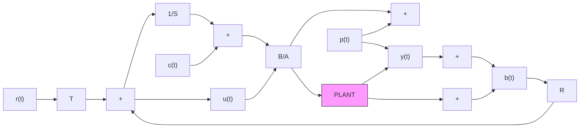

(This function with a positive sign is called the complementary sensitivity function denoted by $\mathcal { T }$ in the robust control literature.) From (8.1) and (8.3) it is obvious that:

$$S _ {y p} (z ^ {- 1}) - S _ {y b} (z ^ {- 1}) = 1 \tag {8.4}$$

The transfer function between the input disturbance $c ( t )$ and the plant output $y ( t )$ is given by:

$$S _ {y c} (z ^ {- 1}) = \frac {z ^ {- d} B (z ^ {- 1}) S (z ^ {- 1})}{P (z ^ {- 1})} \tag {8.5}$$

In order that the system be internally stable, all these sensitivity functions should be asymptotically stable.

For example, using tracking and regulation with independent objectives where $P ( z ^ { - 1 } )$ and $S ( z ^ { - 1 } )$ contains the plant model zeros, one can see that if these zeros(or some of them) are unstable the input sensitivity function $S _ { u p } ( z ^ { - 1 } )$ will be unstable while the other sensitivity functions will be stable because of poles/zeros cancellations. Using now pole placement with the A polynomial as part of the closed loop poles which corresponds to internal model control, instability of A, will show up in $\dot { S } _ { y c } ( z ^ { - 1 } )$ ) (remember that in this case $R ( z ^ { - 1 } ) = A ( z ^ { - 1 } ) R ^ { \prime } ( \bar { z } ^ { - 1 } ) )$ . From these observations, it is clear that, in general, all the four sensitivity functions should be examined once a design is done.
