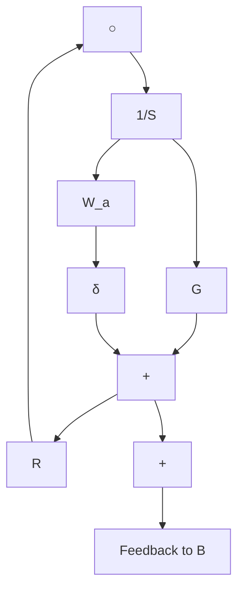
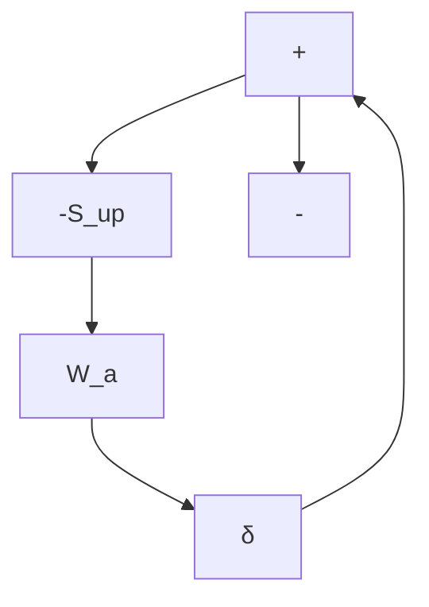
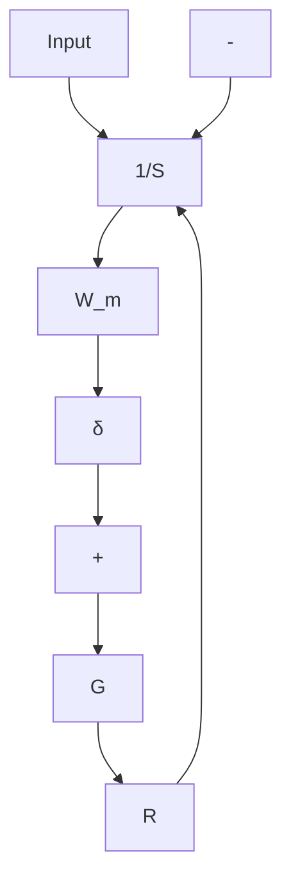
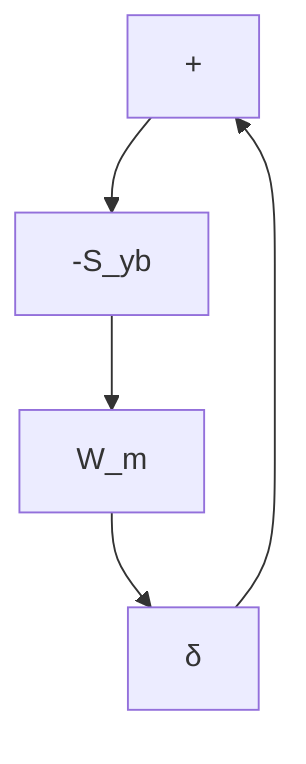

# 8.3 Robust Stability

Fig. 8.6 Additive model uncertainty, (a) uncertainty representation, (b) equivalent representation of the closed-loop system   

flowchart

flowchart

Fig. 8.7 Multiplicative model uncertainty, (a) uncertainty representation, (b) equivalent representation of the closed-loop system   

flowchart

flowchart

In other words $| W _ { a } ( z ^ { - 1 } ) |$ characterizes the size of the additive uncertainties in the frequency domain (maximum value given by $\| { \cal W } _ { a } ( z ^ { - 1 } ) \| _ { \infty } )$ . At a certain frequency, the effect of $\delta ( z ^ { - 1 } )$ will be to allow uncertainties of size $| W _ { a } ( z ^ { - 1 } ) |$ | and with any direction.

2. Multiplicative uncertainties (Fig. 8.7)

$$G ^ {\prime} (z ^ {- 1}) = G (z ^ {- 1}) [ 1 + \delta (z ^ {- 1}) W _ {m} (z ^ {- 1}) ] \tag {8.18}$$

where $W _ { m } ( z ^ { - 1 } )$ is a stable transfer function.

Observes that the additive uncertainties and the multiplicative uncertainties are related by:

$$W _ {a} (z ^ {- 1}) = G (z ^ {- 1}) W _ {m} (z ^ {- 1})$$

(i.e., $W _ { m } ( z ^ { - 1 } )$ corresponds to a relative size uncertainty).

3. Feedback uncertainties on the input (or output) (Fig. 8.8)

$$G ^ {\prime} (z ^ {- 1}) = \frac {G (z ^ {- 1})}{1 + \delta (z ^ {- 1}) W _ {r} (z ^ {- 1})} \tag {8.19}$$

$( W _ { r } ( z ^ { - 1 } )$ can be interpreted as an additive uncertainty on the open-loop transfer function).

We will use one or another of the uncertainty descriptions depending upon the context.
