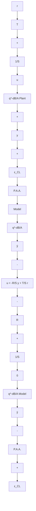

Figure 9.1a illustrates the basis of this iterative procedure (for the case of an RST digital controller). The upper part represents the true closed-loop system and the lower part represents the design system. The objective is to minimize the error between the two systems by using new data acquired in closed-loop operation. Since the problem is not directly tractable, the idea is to improve plant model estimation first and then re-design the controller based on the new model. This sequence of operations is carried out one or several times. However, a key point is that the new plant model estimation should be done in order to reduce the error between the two systems. In fact, the objective is to get a better predictor for the closed loop via a better estimation of the plant model. In addition, in most of the situations, iterative identification in closed loop and controller redesign offer, possible improvements in the performance of a controller previously designed on the basis of a plant model identified in open-loop.

Fig. 9.1 Identification in closed loop, (a) excitation added on the reference, (b) excitation added to the output of the controller   

flowchart

flowchart

