```mermaid
graph TD
    A["Input signal r_u"] --> B["Summing Junction"]
    B --> C["u"]
    C --> D["Plant: q^-dB/A"]
    D --> E["Summing Junction"]
    E --> F["y"]
    F --> G["ε_CL"]
    G --> H["P.A.A."]
    H --> I["Model: q^-dB/Â"]
    I --> J["+"]
    J --> K["R/S"]
    K --> L["Summing Junction"]
    L --> M["u = -R/S y + r_u"]
    M --> N["+"]
    N --> O["Model: q^-dB/Â"]
    O --> P["+"]
    P --> Q["R/S"]
    Q --> R["Summing Junction"]
    R --> S["y"]
    S --> T["ε_CL"]
    T --> U["P.A.A."]
    U --> V["Model: q^-dB/Â"]
    V --> W["+"]
    W --> X["R/S"]
    X --> Y["Summing Junction"]
    Y --> Z["y"]
    Z --> AA["ε_CL"]
    AA --> AB["P.A.A."]
    AB --> AC["Model: q^-dB/Â"]
    AC --> AD["y"]
    AD --> AE["R/S"]
    AE --> AF["Summing Junction"]
    AF --> AG["y"]
    AG --> AH["ε_CL"]
```

In the context of recursive algorithms, the problem of plant model identification in closed loop can be formulated as follows: under the assumption that the controller is constant, identify a plant model such that:

1. Global asymptotic stability is assured for any initial parameter estimates and initial error between the output of the true system and that of the closed-loop predictor (in the absence of noise).   
2. An asymptotically optimal predictor of the true closed-loop system is obtained.   
3. Unbiased estimates of the plant model parameters are obtained asymptotically under appropriate richness conditions (in the presence of noise).

It is assumed that the input-output part of the plant to be identified belongs to the model set.

The problem of identification of a plant model in closed loop can be viewed in two different ways leading however, to similar types of algorithms.

MRAS point of view The true closed-loop system corresponds to a reference model and a parallel adjustable system having a feedback configuration is built up. This adjustable feedback system contains a fixed controller and an adjustable model of the plant. The problem is to design a parameter adaptation algorithm assuring the global asymptotic stability of the closed-loop prediction error (or driving the closed-loop prediction error to zero asymptotically in the absence of noise). This is a dual problem with respect to the classical model reference adaptive control problem.

Identification point of view Construct a reparameterized adjustable predictor for the closed-loop system in terms of a known fixed controller and of an adjustable plant model.
