```mermaid
graph TD
    A["r"] --> B["T"]
    B --> C["+"]
    C --> D["1/S"]
    D --> E["u"]
    E --> F["q⁻dB/A Plant"]
    F --> G["+"]
    G --> H["y"]
    H --> I["ε^CL"]
    I --> J["+"]
    J --> K["Model"]
    K --> L["ŷ"]
    L --> M["+"]
    M --> N["Design system"]
    N --> O["R"]
    O --> P["+"]
    P --> Q["1/S"]
    Q --> R["û"]
    R --> S["q⁻dB/Â"]
    S --> T["+"]
    T --> U["y"]
    U --> V["ε^CL"]
    V --> W["+"]
    W --> X["Design system"]
    X --> Y["R"]
    Y --> Z["+"]
    Z --> AA["1/S"]
    AA --> AB["û"]
    AB --> AC["q⁻dB/Â"]
    AC --> AD["+"]
    AD --> AE["ŷ"]
    AE --> AF["ε^CL"]
    AF --> AG["+"]
    AG --> AH["Design system"]
    AH --> AI["R"]
    AI --> AJ["+"]
    AJ --> AK["1/S"]
    AK --> AL["û"]
    AL --> AM["q⁻dB/Â"]
    AM --> AN["+"]
    AN --> AO["ŷ"]
    AO --> AP["ε^CL"]
```

Let us denote the true plant model by G, the estimated plant model by $\hat { G }$ and the controller computed on the basis of $\hat { G }$ , by $C _ { \hat { G } }$ . We denote the designed performance as $J ( \hat { G } , C _ { \hat { G } } )$ which corresponds in fact to both the optimal performance and the achieved one on the design system. $J ( G , C _ { \hat { G } } )$ corresponds to the achieved performance on the true system. Then one can establish the following triangle inequality (Van den Hof and Schrama 1995):

$$
\begin{array}{l} \| J (\hat {G}, C _ {\hat {G}}) \| - \| J (G, C _ {\hat {G}}) - J (\hat {G}, C _ {\hat {G}}) \| \\ \leq \| J (G, C _ {\hat {G}}) \| \\ \leq \| J (\hat {G}, C _ {\hat {G}}) \| + \| J (G, C _ {\hat {G}}) - J (\hat {G}, C _ {\hat {G}}) \| \tag {9.92} \\ \end{array}
$$

where $J ( \cdot )$ and $\| \cdot \|$ are problem dependent. From (9.92), one can conclude that in order to minimize $\| J ( G , C _ { \hat { G } } ) \|$ one should have:

1. $\| J ( \hat { G } , C _ { \hat { G } } ) \|$ small;   
2. $\| J ( G , C _ { \hat { G } } ) - J ( \hat { G } , C _ { \hat { G } } ) \|$ small.

Since one cannot simultaneously optimize the model and the controller, this will be done sequentially by an iterative procedure as follows:

1. One searches for an identification procedure such that:

$$\hat {G} _ {i + 1} = \underset {\hat {G}} {\arg \min} \| J (G, C _ {i}) - J (\hat {G} _ {i}, C _ {i}) \| \tag {9.93}$$

where i corresponds to the step number in the iteration, and $\hat { G } _ { i }$ corresponds to the estimated model in step i, used for the computation of the controller $C _ { i }$ .

2. Then, one computes a new controller based on $\hat { G } _ { i + 1 }$ :

$$C _ {i + 1} = \arg \min _ {C} \| J (\hat {G} _ {i + 1}, C) \| \tag {9.94}$$

Equation (9.93) is fundamental for designing the closed-loop identification procedure which will depend upon the controller strategy used.
