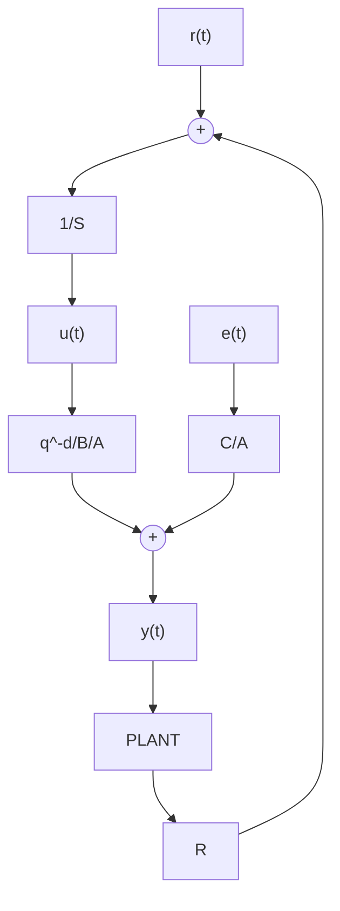

# 9.7.1 Simulation Results

In order to compare different closed-loop identification methods and study the behavior of these algorithms, two simulations examples are considered. In the first example, the parameters of the system and controller are chosen such that $S / P$ be a positive real transfer function and the influence of positive realness of $1 / C$ on the convergence of various algorithm is studied. Several model validation tests are also examined on the identified models. An unstable system in open loop is considered in the second example and in addition $S / P$ is a non-positive real transfer function. Detailed results can be found in Landau and Karimi (1997b).

Example 9.1 Figure 9.3 shows the block diagram of the simulation system, where $B / A$ is the plant model, $R / S$ is the controller, $C / A$ is the noise model and $e ( t )$ is a zero mean value equally distributed white noise. The parameters of the system are chosen as follows:

$$A \left(z ^ {- 1}\right) = 1 - 1. 5 z ^ {- 1} + 0. 7 z ^ {- 2} \tag {9.97}B (z ^ {- 1}) = z ^ {- 1} \left(1 + 0. 5 z ^ {- 1}\right) \tag {9.98}$$

Fig. 9.3 Block diagram of the simulation system   

flowchart

A controller using the pole placement technique is computed such that $S / P$ be positive real (the controller contains an integrator, i.e., S contains a term $( 1 - z ^ { - 1 } )$ which vanishes at the zero frequency). The parameters of the controller and the closed-loop characteristic polynomial are:

$$R (z ^ {- 1}) = 0. 8 6 5 9 - 1. 2 7 6 3 z ^ {- 1} + 0. 5 2 0 4 z ^ {- 2} \tag {9.99}S (z ^ {- 1}) = 1 - 0. 6 2 8 3 z ^ {- 1} - 0. 3 7 1 7 z ^ {- 2} \tag {9.100}P (z ^ {- 1}) = 1 - 1. 2 6 2 4 z ^ {- 1} - 0. 4 2 7 4 z ^ {- 2} \tag {9.101}$$

For identification of the plant model in closed loop a pseudo-random binary sequence (PRBS) generated by a 7-bit shift register and a clock frequency of $\textstyle { \frac { 1 } { 2 } } f _ { s }$ $( f _ { s }$ sampling frequency =1) is considered as reference signal. The noise signal ratio at the output of the closed-loop system is about 10% in terms of variance. Two different cases are considered for the noise model:

Case (a): $1 / C$ is strictly positive real i.e. $C ( z ^ { - 1 } ) = 1 + 0 . 5 z ^ { - 1 } + 0 . 5 z ^ { - 2 }$
