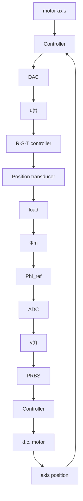

# 9.7.2 Experimental Results: Identification of a Flexible Transmission in Closed-Loop

The experimental device is depicted in Fig. 9.8 and has been described in Sect. 1.4.3. It consists of a flexible transmission which is formed by a set of three pulleys coupled by two very elastic belts. The system is controlled by a PC via an I/O board. The sampling frequency is 20 Hz.

Fig. 9.8 Block diagram of the flexible transmission   

flowchart

The system identification is carried out in open loop with a PC using WinPIM identification software (Adaptech 1988). The output error with extended prediction model algorithm provided the best results in terms of statistical validation (for details see Sect. 5.9). The model obtained in open loop for the unloaded case which passes the validation test is:

$$A = 1 - 1. 3 5 2 8 q ^ {- 1} + 1. 5 5 0 2 q ^ {- 2} - 1. 2 7 9 8 q ^ {- 3} + 0. 9 1 1 5 q ^ {- 4}B = 0. 4 1 1 6 q ^ {- 1} + 0. 5 2 4 q ^ {- 2}; \quad d = 2$$

The main characteristics of the system are: two very oscillatory modes, an unstable zero and a time delay of two sampling periods. A controller for this system is computed by the pole placement method with WinREG software (Adaptech 1988). The controller is designed in order to obtain two dominant poles with the same frequency of the first mode of the open-loop model but with a damping factor of 0.8. The precompensator $T ( q ^ { - 1 } )$ is chosen to obtain unit closed-loop gain. The parameters of the RST controller are as follows:

$$R (q ^ {- 1}) = 0. 4 5 2 6 - 0. 4 5 6 4 q ^ {- 1} - 0. 6 8 5 7 q ^ {- 2} + 1. 0 9 5 5 q ^ {- 3} - 0. 1 4 4 9 q ^ {- 4}S (q ^ {- 1}) = 1 + 0. 2 3 4 5 q ^ {- 1} - 0. 8 7 0 4 q ^ {- 2} - 0. 4 4 7 4 q ^ {- 3} + 0. 0 8 3 3 q ^ {- 4}T (q ^ {- 1}) = 0. 2 6 1 2$$

Implementing the above controller on the real platform using WinTRAC software (Adaptech 1988), the identification of the plant in closed loop is carried out using various methods. A PRBS generated by a 7-bit shift register and a clock frequency of $\textstyle { \frac { 1 } { 2 } } f _ { s }$ is considered as reference signal.
