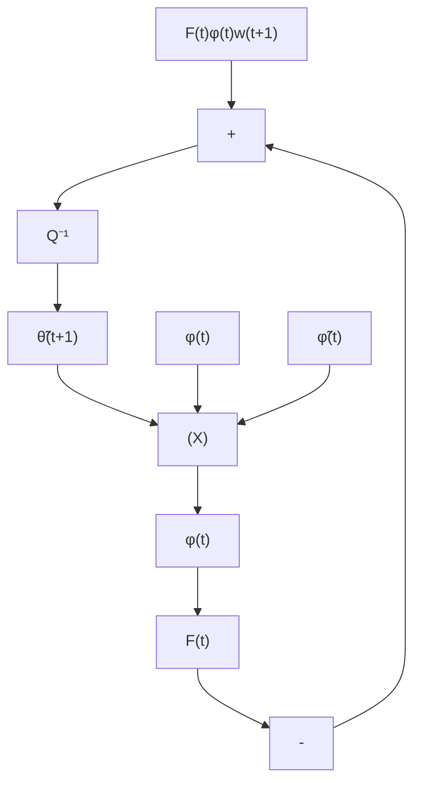

# 10.3 Effect of Disturbances

In order to introduce the various modifications of the PAA, it is useful to examine first the effect of disturbances upon the parameter adaptation algorithms when these disturbances are not characterized by nice stochastic assumptions like: zero mean, finite variance, uncorrelation with the input, ARMA model and so on.

We will start with a qualitative analysis. Assume that the plant output can be described by:

$$y (t + 1) = \theta^ {T} \phi (t) + w (t + 1) \tag {10.3}$$

where $w ( t + 1 )$ is the disturbance, θ is the vector of the model parameters and in this case:

$$\phi^ {T} (t) = [ - y (t), - y (t - 1), \dots , u (t), u (t - 1), \dots ] \tag {10.4}$$

Consider the parameter adaptation equation:

$$\hat {\theta} (t + 1) = \hat {\theta} (t) + F (t) \phi (t) \varepsilon (t + 1) \tag {10.5}$$

where:

$$\varepsilon (t + 1) = y (t + 1) - \hat {\theta} ^ {T} (t + 1) \phi (t) \tag {10.6}$$

Fig. 10.1 Equivalent feedback system representation of the PAA in the presence of disturbances   

flowchart

Replacing y(t + 1) with its expression given by (10.3) and using the notation:

$$\tilde {\theta} (t + 1) = \hat {\theta} (t + 1) - \theta \tag {10.7}$$

one obtains from (10.4):

$$\hat {\theta} (t + 1) = \hat {\theta} (t) + F (t) \phi (t) [ - \phi^ {T} (t) \tilde {\theta} (t + 1) + w (t + 1) ] \tag {10.8}$$

Subtracting θ in both sides of (10.8), one gets the evolution equation for the parameter error in the presence of disturbances:

$$[ I _ {n} + F (t) \phi (t) \phi (t) ^ {T} - I _ {n} q ^ {- 1} ] \tilde {\theta} (t + 1) = F (t) \phi (t) w (t + 1) \tag {10.9}$$

where the eigenvalues of $[ I _ { n } + F ( t ) \phi ( t ) \phi ^ { T } ( t ) ]$ satisfies:

$$\lambda_ {i} [ I _ {n} + F (t) \phi (t) \phi^ {T} (t) ] ^ {- 1} \leq 1; \quad i = 1, \dots , n \tag {10.10}n = \dim \theta \tag {10.11}$$

The equivalent feedback system associated with (10.9) is represented in Fig. 10.1.
