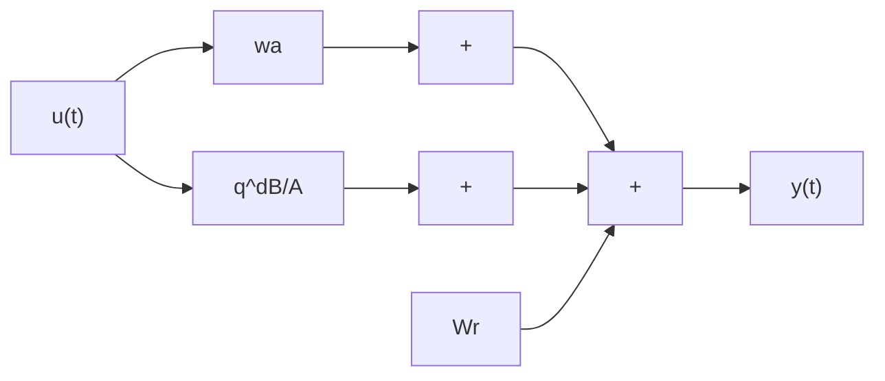

# 10.6 Data Normalization

In Sect. 10.2, it was indicated that data filtering can reduce the effect of unmodeled dynamics by attenuating the high-frequency components of the input and the output. This will allow a better estimation of a low order model, but will not be enough to guarantee the stability of an adaptive control system in the presence of unmodeled dynamics. An additional modification of the data called “data normalization” has to be considered in such cases. The objective of this modification is to obtain (under certain hypotheses) bounded adaptation error in the presence of possibly unbounded plant input-output data.

Some hypotheses have to be made upon the unmodeled dynamics often considered to be “high-frequency”. It is fundamental to assume that the unmodeled dynamics are stable. As a consequence, the magnitude of the unmodeled system response can be bounded in general by the norm of the input-output regressor vector used to describe the modeled part of the system. To be specific, let us consider the following example where the “true” plant model is described by:

$$(1 - a _ {1} q ^ {- 1} + a _ {2} q ^ {- 2}) y (t + 1) = (b _ {1} + b _ {2} q ^ {- 2}) u (t) \tag {10.87}$$

Let us assume that we would like to estimate this plant model using a lower order model with $n _ { A } = 1$ and $n _ { B } = 1$ , i.e.:

$$\bar {y} (t + 1) = - \bar {a} _ {1} y (t) + \bar {b} _ {1} u (t) = \theta^ {T} \phi (t) \tag {10.88}$$

Fig. 10.4 The reduced order model and the unmodeled dynamics   

flowchart

where:

$$\theta^ {T} = [ \bar {a} _ {1}, \bar {b} _ {1} ]; \quad \phi^ {T} (t) = [ - y (t), u (t) ] \tag {10.89}$$

Therefore, the “true” output of the plant model (10.87) can be written as:

$$y (t + 1) = \theta^ {T} \phi (t) + w (t + 1) \tag {10.90}$$

where $w ( t + 1 )$ the “unmodelled” response (which can be interpreted also as a disturbance) is given by:

$$
\begin{array}{l} w (t + 1) = (\bar {a} _ {1} - a _ {1}) y (t) - a _ {2} y (t - 1) + (b _ {1} - \bar {b} _ {1}) u (t) + b _ {2} u (t - 1) \\ = \alpha_ {1} ^ {T} \phi (t) + \alpha_ {2} ^ {T} \phi (t - 1) \\ = H ^ {T} (q ^ {- 1}) \phi (t) = q ^ {- 1} H ^ {T} (q ^ {- 1}) \phi (t + 1) \tag {10.91} \\ \end{array}
$$
