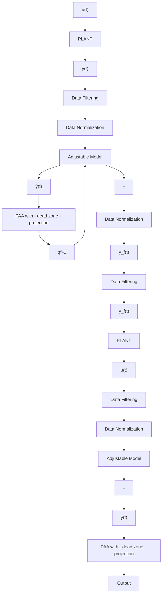

# 10.8 Concluding Remarks

1. Robustification of parameter adaptation algorithms is necessary when:

• the true plant model and the estimated plant model do not have the same structure;   
• the disturbances are characterized only by an upper bound;   
• enhancement of the input-output data spectrum in a certain frequency region is required.

Fig. 10.7 A robust parameter estimation scheme   

flowchart

2. One of the major tasks of robustification is to assure bounded parameter estimates in the presence of disturbances and possible unbounded input-output data.   
3. The main modifications used for robustification of parameter adaptation algorithms are:

• filtering of input-output data;   
• data normalization;   
• PAA with dead zone;   
• PAA with projection;   
• PAA without integrator effect.
