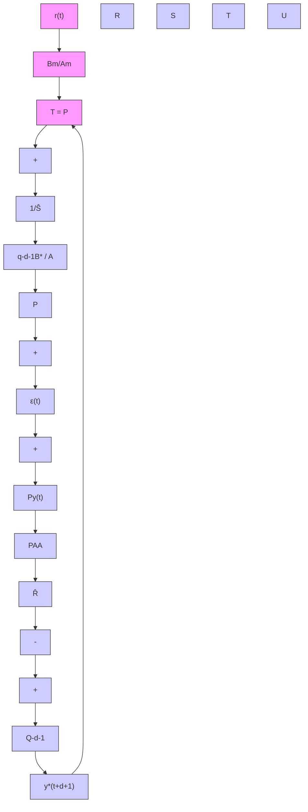
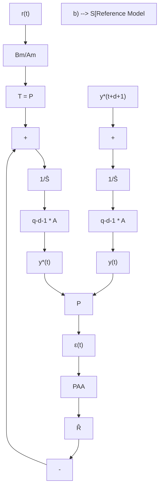

$$\hat {S} (t, q ^ {- 1}) = \hat {s} _ {0} (t) + \hat {s} _ {1} (t) q ^ {- 1} + \dots + \hat {s} _ {n _ {S}} (t) q ^ {- n _ {S}} = 1 + q ^ {- 1} \hat {S} ^ {*} (t, q ^ {- 1}) \quad (1 1. 5)\hat {R} (t, q ^ {- 1}) = \hat {r} _ {0} (t) + \hat {r} _ {1} (t) q ^ {- 1} + \dots + \hat {r} _ {n _ {R}} (t) q ^ {- n _ {R}} \tag {11.6}$$

which can be written alternatively as (see also (7.111)):

$$\hat {\theta} _ {C} ^ {T} (t) \phi_ {C} (t) = P (q ^ {- 1}) y ^ {*} (t + d + 1) \tag {11.7}$$

flowchart

flowchart

Fig. 11.1 Adaptive tracking and regulation with independent objective; (a) basic configuration, (b) a model reference adaptive control interpretation

where:

$$\hat {\theta} _ {C} ^ {T} (t) = [ \hat {s} _ {0} (t), \dots , \hat {s} _ {n _ {S}} (t), \hat {r} _ {0} (t), \dots , \hat {r} _ {n _ {R}} (t) ]; \quad \hat {s} _ {0} (t) = \hat {b} _ {1} (t) \tag {11.8}\phi_ {C} ^ {T} (t) = [ u (t), \dots , u (t - n _ {S}), y (t), \dots , y (t - n _ {R}) ] \tag {11.9}$$
