(2) Use an indirect adaptive approach by building an adaptive predictor reparameterized in terms of the controller parameters and force the predictor output to follow exactly the reference trajectory by an appropriate choice of the control. (This corresponds to the use of the ad-hoc separation theorem.)

Both approaches lead to the same scheme. The corresponding block diagram of adaptive minimum variance tracking and regulation is shown in Fig. 11.2. The major difference with regard to adaptive tracking and regulation with independent objectives is the fact that the closed-loop poles and the parameters of the precompensator $T$ , depend on the noise model (polynomial C) which is unknown and should be estimated. Therefore with respect to the deterministic case, there are more parameters to be adapted.

```mermaid
graph TD
    A["r(t)"] --> B["Bm/Am"]
    B --> C["Ĉ"]
    C --> D["+"]
    D --> E["1/Ŝ"]
    E --> F["q⁻ᵈ⁻¹B* / A"]
    F --> G["+"]
    G --> H["ε(t)"]
    H --> I["PAA"]
    I --> J["e(t)"]
    J --> K["C/A"]
    K --> L["+"]
    L --> M["ε(t)"]
    M --> N["+"]
    N --> O["ε(t)"]
    O --> P["+"]
    P --> Q["ε(t)"]
    Q --> R["+"]
    R --> S["ε(t)"]
    S --> T["+"]
    T --> U["ε(t)"]
    U --> V["+"]
    V --> W["ε(t)"]
    W --> X["+"]
    X --> Y["ε(t)"]
    Y --> Z["+"]
    Z --> AA["ε(t)"]
    AA --> AB["+"]
    AB --> AC["ε(t)"]
    AC --> AD["+"]
    AD --> AE["ε(t)"]
    AE --> AF["+"]
    AF --> AG["ε(t)"]
    AG --> AH["+"]
    AH --> AI["ε(t)"]
    AI --> AJ["+"]
    AJ --> AK["ε(t)"]
    AK --> AL["+"]
    AL --> AM["ε(t)"]
    AM --> AN["+"]
    AN --> AO["ε(t)"]
    AO --> AP["+"]
    AP --> AQ["ε(t)"]
    AQ --> AR["+"]
    AR --> AS["ε(t)"]
    AS --> AT["+"]
    AT --> AU["ε(t)"]
    AU --> AV["+"]
    AV --> AW["ε(t)"]
    AW --> AX["+"]
    AX --> AY["ε(t)"]
    AY --> AZ["+"]
    AZ --> BA["ε(t)"]
    BA --> BB["+"]
    BB --> BC["ε(t)"]
    BC --> BD["+"]
    BD --> BE["ε(t)"]
    BE --> BF["+"]
    BF --> BG["ε(t)"]
    BG --> BH["+"]
    BH --> BI["ε(t)"]
    BI --> BJ["+"]
    BJ --> BK["ε(t)"]
    BK --> BL["+"]
    BL --> BM["ε(t)"]
    BM --> BN["+"]
    BN --> BO["ε(t)"]
    BO --> BP["+"]
    BP --> BQ["ε(t)"]
    BQ --> BR["+"]
    BR --> BS["ε(t)"]
    BS --> BT["+"]
    BT --> BU["ε(t)"]
    BU --> BV["+"]
    BV --> BW["ε(t)"]
    BW --> BX["+"]
    BX --> BY["ε(t)"]
    BY --> BZ["+"]
    BZ --> CA["ε(t)"]
    CA --> CB["+"]
    CB --> CC["ε(t)"]
    CC --> CD["+"]
    CD --> CE["ε(t)"]
    CE --> CF["+"]
    CF --> CG["ε(t)"]
    CG --> CH["+"]
    CH --> CI["ε(t)"]
    CI --> CJ["+"]
    CJ --> CK["ε(t)"]
```

flowchart

Fig. 11.2 Adaptive minimum variance tracking and regulation
