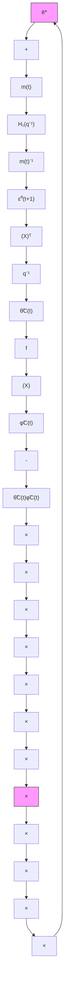

where $\bar { H } _ { 1 }$ is an input-output operator whose properties are related to those of $H _ { 1 } ( q ^ { - 1 } )$ . Systems (11.239) and (11.235) form a feedback interconnection. This is shown in Fig. 11.3 where the detailed structure of (11.239) is emphasized. One observes the presence of multipliers in the feedforward path, as well as the presence of a delay in the feedback path (this is why the PAA is not passive). The use of multipliers in analysis of stability of feedback systems goes back to the Popov criterion (Popov 1960) and is part of the “loop transformations” used in the analysis of feedback systems (Desoer and Vidyasagar 1975). Provided that the multipliers and their inverse are bounded causal operators, the stability of the equivalent system will imply the stability of the system without multipliers, from which it will be possible to conclude upon the boundedness of $\phi _ { C } ( t )$ and $\varepsilon ^ { 0 } ( t + 1 )$ .

The proof is divided in two major steps:

1. Analysis of the stability of the normalized equivalent feedback system (Fig. 11.3).   
2. Proof of boundedness of $\phi _ { C } ( t )$ and of the multipliers and their inverse which implies in fact the stability of the feedback system without multipliers.

flowchart

Fig. 11.3 Equivalent feedback representations of the direct adaptive control scheme in the presence of unmodeled dynamics when using data normalization

We will limit ourselves to the point 1 of the proof. To do this we need an intermediate result upon the passivity of the system (11.239).

Lemma 11.5 For the system (11.239) with input $- \tilde { \theta } ^ { T } ( t ) \bar { \phi } _ { C } ( t )$ and output $\bar { \varepsilon } ^ { 0 } ( t + 1 )$ , one has for $\bar { e } ^ { * } ( t ) = 0$ :
