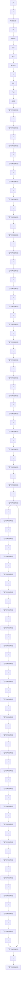

```mermaid
graph TD
    A["ē*"] --> B["+"]
    B --> C["θ̃C(t)φ̃C(t)"]
    C --> D["¯H1"]
    D --> E["ε̄0(t+1)"]
    E --> F["(X)T"]
    F --> G["q^-1"]
    G --> H["θC(t+1)"]
    H --> I["f"]
    I --> J["(X)"]
    J --> K["¯H2"]
    K --> L["φ̃C(t)"]
    L --> M["¯Q^T(θC(t)φ̃C(t))"]
    M --> N["+"]
    N --> O["¯Q^T(θC(t)φ̃C(t))"]
    O --> P["+"]
    P --> Q["¯Q^T(θC(t)φ̃C(t))"]
    Q --> R["+"]
    R --> S["¯Q^T(θC(t)φ̃C(t))"]
    S --> T["+"]
    T --> U["¯Q^T(θC(t)φ̃C(t))"]
    U --> V["+"]
    V --> W["¯Q^T(θC(t)φ̃C(t))"]
    W --> X["+"]
    X --> Y["¯Q^T(θC(t)φ̃C(t))"]
    Y --> Z["+"]
    Z --> AA["¯Q^T(θC(t)φ̃C(t))"]
    AA --> AB["+"]
    AB --> AC["¯Q^T(θC(t)φ̃C(t))"]
    AC --> AD["+"]
    AD --> AE["¯Q^T(θC(t)φ̃C(t))"]
    AE --> AF["+"]
    AF --> AG["¯Q^T(θC(t)φ̃C(t))"]
    AG --> AH["+"]
    AH --> AI["¯Q^T(θC(t)φ̃C(t))"]
    AI --> AJ["+"]
    AJ --> AK["¯Q^T(θC(t)φ̃C(t))"]
    AK --> AL["+"]
    AL --> AM["¯Q^T(θC(t)φ̃C(t))"]
    AM --> AN["+"]
    AN --> AO["¯Q^T(θC(t)φ̃C(t))"]
    AO --> AP["+"]
    AP --> AQ["¯Q^T(θC(t)φ̃C(t))"]
    AQ --> AR["+"]
    AR --> AS["¯Q^T(θC(t)φ̃C(t))"]
    AS --> AT["+"]
    AT --> AU["¯Q^T(θC(t)φ̃C(t))"]
    AU --> AV["+"]
    AV --> AW["¯Q^T(θC(t)φ̃C(t))"]
    AW --> AX["+"]
    AX --> AY["¯Q^T(θC(t)φ̃C(t))"]
    AY --> AZ["+"]
    AZ --> BA["¯Q^T(θC(t)φ̃C(t))"]
    BA --> BB["+"]
    BB --> BC["¯Q^T(θC(t)φ̃C(t))"]
    BC --> BD["+"]
    BD --> BE["¯Q^T(θC(t)φ̃C(t))"]
    BE --> BF["+"]
    BF --> BG["¯Q^T(θC(t)φ̃C(t))"]
    BG --> BH["+"]
    BH --> BI["¯Q^T(θC(t)φ̃C(t))"]
    BI --> BJ["+"]
    BJ --> BK["¯Q^T(θC(t)φ̃C(t))"]
    BK --> BL["+"]
    BL --> BM["¯Q^T(θC(t)φ̃C(t))"]
    BM --> BN["+"]
    BN --> BO["¯Q^T(θC(t)φ̃C(t))"]
    BO --> BP["+"]
    BP --> BQ["¯Q^T(θC(t)φ̃C(t))"]
    BQ --> BR["+"]
    BR --> BS["¯Q^T(θC(t)φ̃C(t))"]
    BS --> BT["+"]
    BT --> BU["¯Q^T(θC(t)φ̃C(t))"]
    BU --> BV["+"]
    BV --> BW["¯Q^T(θC(t)φ̃C(t))"]
    BW --> BX["+"]
    BX --> BY["¯Q^T(θC(t)φ̃C(t))"]
    BY --> BZ["+"]
    BZ --> CA["¯Q^T(θC(t)φ̃C(t))"]
    CA --> CB["+"]
    CB --> CC["¯Q^T(θC(t)φ̃C(t))"]
    CC --> CD["+"]
    CD --> CE["¯Q^T(θC(t)φ̃C(t))"]
    CE --> CF["+"]
    CF --> CG["¯Q^T(θC(t)φ̃C(t))"]
    CG --> CH["+"]
    CH --> CI["¯Q^T(θC(t)φ̃C(t))"]
    CI --> CJ["+"]
    CJ --> CK["¯Q^T(θC(t)φ̃C(t))"]
    CK --> CL["+"]
    CL --> CM["¯Q^T(θC(t)φ̃C(t))"]
    CM --> CN["+"]
    CN --> CO["¯Q^T(θC(t)φ̃C(t))"]
    CO --> CP["+"]
    CP --> CQ["¯Q^T(θC(t)φ̃C(t))"]
    CQ --> CR["+"]
    CR --> CS["¯Q^T(θC(t)φ̃C(t))"]
    CS --> CT["+"]
    CT --> CU["¯Q^T(θC(t)φ̃C(t))"]
    CU --> CV["+"]
    CV --> CW["¯Q^T(θC(t)φ̃C(t))"]
    CW --> CX["+"]
    CX --> CY["¯Q^T(θC(t)φ̃C(t))"]
    CY --> CZ["+"]
    CZ --> DA["¯Q^T(θC(t)φ̃C(t))"]
    DA --> DB["+"]
    DB --> DC["¯Q^T(θC(t)φ̃C(t))"]
    DC --> DD["+"]
    DD --> DE["¯Q^T(θC(t)φ̃C(t))"]
    BE --> DC
```

