# 12.6 Adaptive Tracking and Robust Regulation

The idea in this approach is to:

1. use of a robust linear controller with fixed parameters for regulation $( R ( q ^ { - 1 } )$ and $S ( q ^ { - 1 } ) )$ ;

Fig. 12.5 Adaptive tracking and robust regulation   

```mermaid
graph TD
    A["y*"] --> B["ˆT"]
    B --> C["+"]
    C --> D["1/S"]
    D --> E["u"]
    E --> F["q^dB/A"]
    F --> G["y"]
    G --> H["+"]
    H --> I["Q^dB/P̂"]
    I --> J["-"]
    J --> K["R"]
    K --> L["+"]
    L --> M["P.A.A"]
    M --> N["-"]
    N --> O["Q^dB/P̂"]
    O --> P["+"]
    P --> Q["+"]
    Q --> R["Q^dB/A"]
    R --> S["y"]
    S --> T["+"]
    T --> U["Q^dB/P̂"]
    U --> V["-"]
    V --> W["R"]
    W --> X["+"]
    X --> Y["Q^dB/A"]
    Y --> Z["y"]
    Z --> AA["+"]
    AA --> AB["Q^dB/P̂"]
    AB --> AC["-"]
    AC --> AD["R"]
    AD --> AE["+"]
    AE --> AF["Q^dB/A"]
    AF --> AG["y"]
    AG --> AH["+"]
    AH --> AI["Q^dB/P̂"]
    AI --> AJ["-"]
    AJ --> AK["R"]
    AK --> AL["+"]
    AL --> AM["Q^dB/A"]
    AM --> AN["y"]
    AN --> AO["+"]
    AO --> AP["Q^dB/P̂"]
    AP --> AQ["-"]
    AQ --> AR["R"]
    AR --> AS["+"]
    AS --> AT["Q^dB/A"]
    AT --> AU["y"]
    AU --> AV["+"]
    AV --> AW["Q^dB/P̂"]
    AW --> AX["-"]
    AX --> AY["R"]
    AY --> AZ["+"]
    AZ --> BA["Q^dB/A"]
    BA --> BB["y"]
    BB --> BC["+"]
    BC --> BD["Q^dB/P̂"]
    BD --> BE["-"]
    BE --> BF["R"]
    BF --> BG["+"]
    BG --> BH["Q^dB/A"]
    BH --> BI["y"]
    BI --> BJ["+"]
    BJ --> BK["Q^dB/P̂"]
    BK --> BL["-"]
    BL --> BM["R"]
    BM --> BN["+"]
    BN --> BO["Q^dB/A"]
    BO --> BP["y"]
    BP --> BQ["+"]
    BQ --> BR["Q^dB/P̂"]
    BR --> BS["-"]
    BS --> BT["R"]
    BT --> BU["+"]
    BU --> BV["Q^dB/A"]
    BV --> BW["y"]
    BW --> BX["+"]
    BX --> BY["Q^dB/P̂"]
    BY --> BZ["-"]
    BZ --> CA["R"]
    CA --> CB["+"]
    CB --> CC["Q^dB/A"]
    CC --> CD["y"]
    CD --> CE["+"]
    CE --> CF["Q^dB/P̂"]
    CF --> CG["-"]
    CG --> CH["R"]
    CH --> CI["+"]
    CI --> CJ["Q^dB/A"]
    CJ --> CK["y"]
    CK --> CL["+"]
    CL --> CM["Q^dB/P̂"]
    CM --> CN["-"]
    CN --> CO["R"]
    CO --> CP["+"]
    CP --> CPB["Q^dB/A"]
    CPB --> CP0["-"]
    CP0 --> CP1["R"]
    CP1 --> CP2["-"]
    CP2 --> CP3["R"]
    CP3 --> CP4["-"]
    CP4 --> CP5["R"]
    CP5 --> CP6["-"]
    CP6 --> CP7["R"]
```

flowchart

2. identify the closed-loop poles (either directly or indirectly by identifying the plant model in closed-loop operation and computing the closed-loop poles);   
3. adapt the parameters of the precompensator $\hat { T } ( t , q ^ { - 1 } )$ ) based on the current poles and zeros of the closed loop.

This is illustrated in Fig. 12.5.

This technique is compared with a robust controller and with an indirect adaptive controller in Sect. 12.7 (Fig. 12.14) for the case of the control of the flexible transmission.
