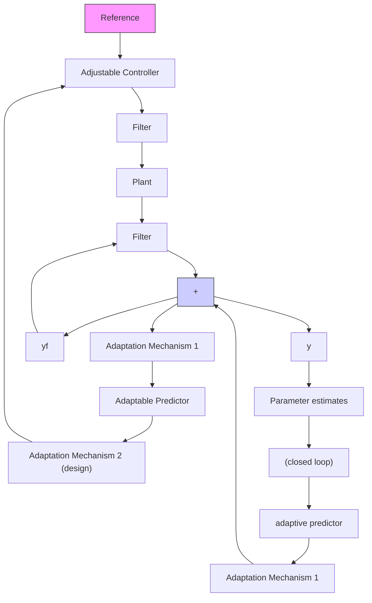

# 12.7.1 Adaptive Pole Placement

In this case, the pole placement will be used as control strategy but two types of parameter estimators will be used:

1. filtered recursive least squares;   
2. filtered closed-loop output error (F-CLOE).

As indicated in Chap. 1 in indirect adaptive control the objective of the plant parameter estimation is to provide the best prediction for the behavior of the closed loop system, for given values of the controller parameters. This can be achieved by either using appropriate data filters on plant input-output data or by using adaptive predictors for the closed-loop system parameterized in terms of the controller parameters and plant parameters (Landau and Karimi 1997b). The corresponding parameter estimators are illustrated in Figs. 12.6a and 12.6b and details can be found in Chap. 9.

flowchart

flowchart

