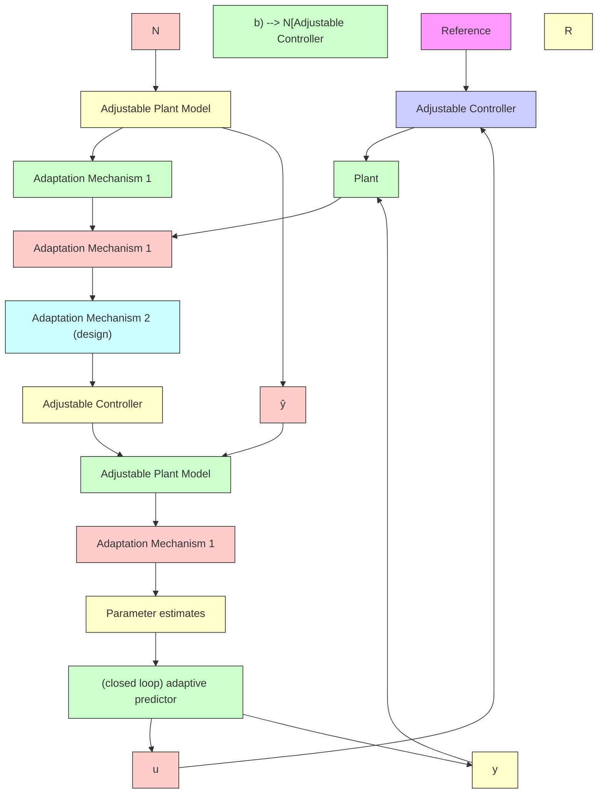

Fig. 12.6 Indirect adaptive control with closed-loop adjustable predictors, (a) using input-output data filters, (b) using closed-loop predictors

These experiments have been carried out using the real time simulation package Vissim/RT (Visual Solutions 1995). Figs. 12.7, 12.8 and 12.9 show the behavior of the adaptive pole placement using filtered recursive least squares without adaptation freezing for various loads. In each experiment, an open-loop identification for the initialization of the adaptive scheme is carried out during 128 samples, then one closes the loop and one sends a sequence of step reference changes followed by the application of a position disturbance. The upper curves show the reference trajectory and the output of the system, the curves in the middle show the evolution of the input and the lower curves show the evolution of the estimated parameters. One can observe that the system is almost tuned at the end of the initialization period.

