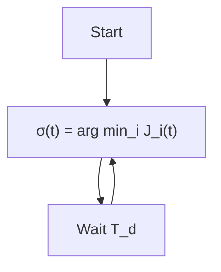

# 13.3 Stability Issues

Fig. 13.2 Flowchart of switching logics   


<details>
<summary>flowchart</summary>


</details>

Dwell-time


<details>
<summary>flowchart</summary>

```mermaid
graph TD
    A["Start"] --> B["σ(t) = arg min_i J_i(t)"]
    B --> C{J_σ ≤ (1 + h)J_i}
    C -->|No| B
    C -->|Yes| D["End"]
```
</details>

Hysteresis
