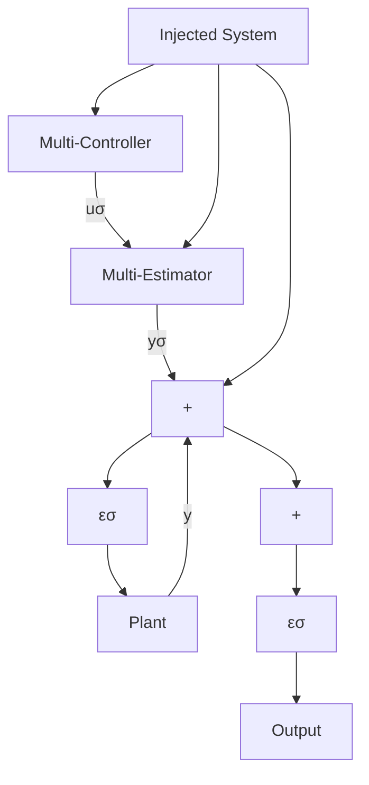

# 13.3.1 Stability of Adaptive Control with Switching

Consider a trivial case in which one of the models in the multi-estimator block matches perfectly with the plant model (no unmodeled dynamics). Suppose that there is no measurement noise and that the plant is detectable.1 In this case, the estimation error for one of the models, say $\varepsilon _ { k } ( t )$ goes to zero. Consequently $\varepsilon _ { \sigma } ( t )$ goes to zero and the switching signal $\sigma ( t )$ goes to k (switching stops after a finite time). It is evident that $C _ { k }$ which stabilizes the kth model will stabilize the plant based on the certainty equivalence stabilization theorem.

However, in practice, because of unmodeled dynamics and measurement noise, the switching will not necessarily stop after a finite time and the analysis becomes more involved.

To proceed, we consider the following assumptions:

Fig. 13.3 Representation of the closed-loop system including the injected system   

flowchart

A1: In the multi-estimator block there exists at least one “good” estimator. It means that at least for one estimator, say estimator k, the estimation error is “small”. The smallness of the estimation error can be defined by an upper bound that depends on the modeling error and noise variance.

A2: $\varepsilon _ { \sigma } ( t ) = y ( t ) - y _ { \sigma } ( t )$ is small. It means that the monitoring signal, switching criterion J (t), and the switching logic are properly designed (α, β and λ are well tuned and dwell-time or hysteresis are not too large).
