# 13.4.3 Experimental Results

The bloc diagram of the control architecture is illustrated in Fig. 13.4. $G _ { 1 } , G _ { 2 }$ and $G _ { 3 }$ represent unloaded, half loaded and fully loaded models, respectively. $\hat { G }$ is the adaptive model using the CLOE algorithm, see Sect. 12.7.1. At every instant, the switching signal $\sigma ( t ) \in \{ 0 , 1 , 2 , 3 \}$ indicates the best model (0 for adaptive model and 1, 2 and 3 for $G _ { 1 } , G _ { 2 }$ and $G _ { 3 }$ , respectively) according to the performance index of (13.2) and the control input $u ( t )$ is determined based on this model and using the pole placement method.

Three experiments are performed on the real system. The aim and objective of these experiments are summarized as follows:

```mermaid
graph TD
    r_t["r(t)"] --> A["Pole Placement Controller"]
    A --> B["u"]
    B --> C["PLANT"]
    C --> D["y"]
    D --> E["Supervisor"]
    E --> F["Gσ"]
    A --> G["\hat{G}"]
    G --> H["\hat{y}"]
    H --> I["P.A.A."]
    I --> J["\hat{y}"]
    J --> K["\hat{εCL}"]
    K --> L["\epsilon CL"]
    L --> M["\epsilon 0"]
    M --> N["\hat{y}_0"]
    N --> O["\epsilon 1"]
    O --> P["\hat{y}_1"]
    P --> Q["\epsilon 2"]
    Q --> R["\hat{y}_2"]
    R --> S["\epsilon 3"]
    S --> T["\hat{y}_3"]
    T --> U["\epsilon 0"]
    U --> V["\hat{y}_0"]
    V --> W["\epsilon 1"]
    W --> X["\hat{y}_1"]
    X --> Y["\epsilon 2"]
    Y --> Z["\hat{y}_2"]
    Z --> AA["\epsilon 3"]
    AA --> AB["\hat{y}_3"]
    AB --> AC["\epsilon 0"]
    AC --> AD["\hat{y}_0"]
    AD --> AE["\epsilon 1"]
    AE --> AF["\hat{y}_1"]
    AF --> AG["\epsilon 2"]
    AG --> AH["\hat{y}_2"]
    AH --> AI["\epsilon 3"]
    AI --> AJ["\hat{y}_3"]
    AJ --> AK["\epsilon 0"]
```

flowchart

Fig. 13.4 Bloc diagram of the real-time experiments

Experiment 1: Comparison of fixed robust control versus adaptive control with switching which shows a reduction of tracking error for the adaptive system.

Experiment 2: Comparison of classical adaptive control versus adaptive control with switching which results in a faster parameter adaptation and better reliability for multimodel adaptive system.

Experiment 3: Studying the behavior of the adaptive control system when the fixed models (0%, 50% and 100% load) do not correspond to reality (25%, 75% load) which illustrates fast parameter adaptation.
