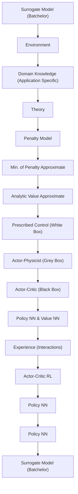

Fig. 2 summarizes the relations between these methods and the environment and the theory. On the left of the chart, we see two fundamental notions of the Reinforcement Learning – the environment and the agent. The upper block illustrates that the theory provides a base for the models and approaches discussed. In the lower block of the chart, we list all the models we discuss and use in the manuscript. Starting to the right, one has the most interpretable control which rely on strong assumptions that may not be satisfied by the environment. Moving to the left, control becomes less interpretable. Arrows describe relations between the models and how they acquire information about the environment (physics of the stochastic flows).   

flowchart

FIG. 2. Flowchart explaining the relations between RL, environment, theory, and the components of the different control schemes.
