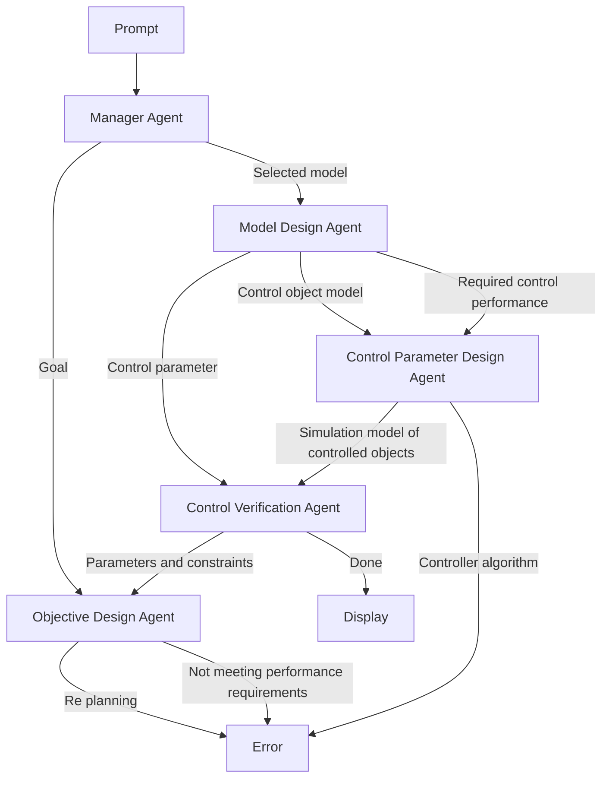

# B. Agent Role Design

The roles of these agents are designed as follows and the flow char of objective oriented controller design is shown in Figure 2.

1) Manager Agent: The Manager Agent is a crucial component in the multi-agent system, acting as the coordinator among the team of agents. Its primary role is to orchestrate the objective Orient Controller Design workflow, which includes identifying relevant questions, forwarding these inquiries to the appropriate agent, and summarizing the results.

flowchart

Fig. 1. Workflow of Objective Oriented Controller Design.

flowchart

