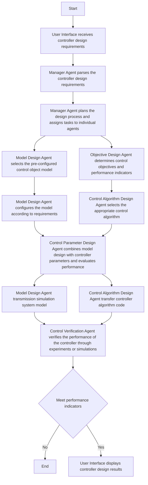

Fig. 2. Flow chart of Objective Oriented Controller Design.

2) Objective Design Agent: This agent is responsible for determining the control objectives and performance indicators. It needs to set the control objectives of the system according to its actual needs, such as stabilizing the system, tracking a given trajectory, or making the system respond faster, etc. At the same time, it needs to set corresponding performance indicators, such as the stability of the system, tracking error, response time, and oscillation, etc.   
3) Model Design Agent: The Model Design Agent is responsible for establishing a simulation model of the control object. This model can help us understand the dynamic be-

havior of the system and provide necessary information for the design of the controller.
