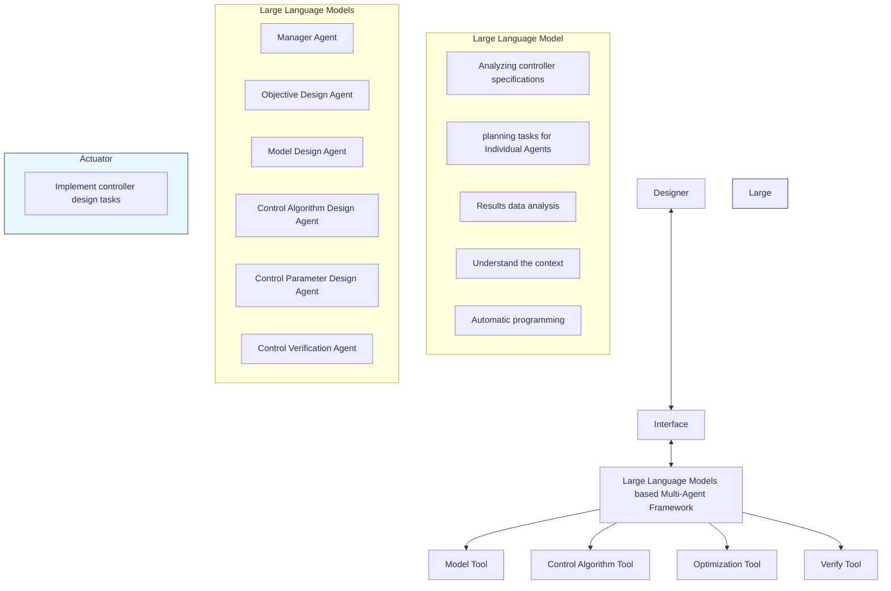

# A. Model Design Agent

The primary task of the Model Design Agent is to select simulation models and generate the Parameter for power electronic devices. It receives parsed design requirements from the Manager Agent. These requirements include specific details such as the type of power electronic device, input-output voltage requirements, and load conditions. The agent then processes these requirements and selects the most appropriate Modelica model template using the Modelica model tool.

flowchart

Fig. 3. Initial implementation of the multi-agent framework

1) Tool: The Modelica model tool is a key tool in this process [9]. It may cover different types of converters, including buck, boost, and buck-boost converters. These templates serve as the starting point for model design, providing parameters that can be adjusted according to specific design requirements. Once the most suitable template is selected, the Model Design Agent adjusts the variables and parameter values within the model template.   
2) Output: Upon completion of all configurations, the agent provides the Modelica model file address and model parameters. This Modelica model file address is then passed on to the Simulation Agent. It serves as the foundation for subsequent simulation verification and parameter optimization.
