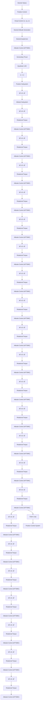

```mermaid
graph TD
    A["Desired Values"] --> B["Position Control"]
    B --> C["Virtual Control Ux, Uy, Uz"]
    C --> D["Desired Attitude Generation"]
    D --> E["Desired Quaternion"]
    E --> F["Attitude Control (AFTSMC)"]
    F --> G["Generating Thrust"]
    G --> H["Quadrator UAV"]
    H --> I["X, Y, Z"]
    I --> J["Position Subsystem"]
    J --> K["q0, q1, q2"]
    K --> L["Attitude Subsystem"]
    L --> M["q0, q1, q2"]
    M --> N["Rotational Torque"]
    N --> O["Attitude Control (AFTSMC)"]
    O --> P["q0, q1, q2"]
    P --> Q["Rotational Torque"]
    Q --> R["Attitude Control (AFTSMC)"]
    R --> S["q0, q1, q2"]
    S --> T["Rotational Torque"]
    T --> U["Attitude Control (AFTSMC)"]
    U --> V["q0, q1, q2"]
    V --> W["Rotational Torque"]
    W --> X["Attitude Control (AFTSMC)"]
    X --> Y["q0, q1, q2"]
    Y --> Z["Rotational Torque"]
    Z --> AA["Attitude Control (AFTSMC)"]
    AA --> AB["q0, q1, q2"]
    AB --> AC["Rotational Torque"]
    AC --> AD["Attitude Control (AFTSMC)"]
    AD --> AE["q0, q1, q2"]
    AE --> AF["Rotational Torque"]
    AF --> AG["Attitude Control (AFTSMC)"]
    AG --> AH["q0, q1, q2"]
    AH --> AI["Rotational Torque"]
    AI --> AJ["Attitude Control (AFTSMC)"]
    AJ --> AK["q0, q1, q2"]
    AK --> AL["Rotational Torque"]
    AL --> AM["Attitude Control (AFTSMC)"]
    AM --> AN["q0, q1, q2"]
    AN --> AO["Rotational Torque"]
    AO --> AP["Attitude Control (AFTSMC)"]
    AP --> AQ["q0, q1, q2"]
    AQ --> AR["Rotational Torque"]
    AR --> AS["Attitude Control (AFTSMC)"]
    AS --> AT["q0, q1, q2"]
    AT --> AU["Rotational Torque"]
    AU --> AV["Attitude Control (AFTSMC)"]
    AV --> AW["q0, q1, q2"]
    AW --> AX["Rotational Torque"]
    AX --> AY["Attitude Control (AFTSMC)"]
    AY --> AZ["q0, q1, q2"]
    AZ --> BA["Rotational Torque"]
    BA --> BB["Attitude Control (AFTSMC)"]
    BB --> BC["q0, q1, q2"]
    BC --> BD["Rotational Torque"]
    BD --> BE["Attitude Control (AFTSMC)"]
    BE --> BF["q0, q1, q2"]
    BF --> BG["Rotational Torque"]
    BG --> BH["Attitude Control (AFTSMC)"]
    BH --> BI["q0, q1, q2"]
    BI --> BJ["Rotational Torque"]
    BJ --> BK["Attitude Control (AFTSMC)"]
    BK --> BL["q0, q1, q2"]
    BL --> BM["Rotational Torque"]
    BM --> BN["Attitude Control (AFTSMC)"]
    BN --> BO["q0, q1, q2"]
    BO --> BP["Rotational Torque"]
    BP --> BQ["Attitude Control (AFTSMC)"]
    BQ --> BR["q0, q1, q2"]
    BR --> BS["Rotational Torque"]
    BS --> BT["Attitude Control (AFTSMC)"]
    BT --> BU["q0, q1, q2"]
    BU --> BV["Rotational Torque"]
    BV --> BW["Attitude Control (AFTSMC)"]
    BW --> BX["q0, q1, q2"]
    BX --> BY["Rotational Torque"]
    BY --> BZ["Attitude Control (AFTSMC)"]
    BE --> CA["Outer Loop"]
    CA --> CB["Position Control System"]
```

