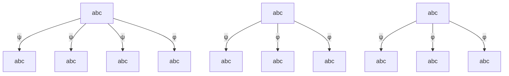

Figure 2. Adversarial Iterated Boolean Game graph. All state transitions are bi-directional. Payoffs for φ and ψ satisfaction directed runs highlighted and super-imposed.

$$
\mathbf {T} _ {\text {Social,Optimistic}} = \left[ \begin{array}{c c c c} 0 & \frac {\mathbb {P} \left(c _ {0} , c _ {1}\right) + 2 \mathbb {P} \left(c _ {1} , c _ {0}\right) + \mathbb {P} \left(c _ {0} \| c _ {1}\right)}{g _ {0}} & \frac {2 \mathbb {P} \left(c _ {0} , c _ {1}\right)}{g _ {0}} & \dots \\ \frac {\mathbb {P} \left(c _ {0} , c _ {1}\right)}{g _ {1}} & 0 & \frac {\mathbb {P} \left(c _ {0} \| c _ {1}\right)}{g _ {1}} & \dots \\ 0 & \frac {\mathbb {P} \left(c _ {0} \| c _ {1}\right)}{g _ {2}} & 0 & \dots \\ \vdots & \vdots & \vdots & \ddots \end{array} \right] = \left[ \begin{array}{c c c c c c c c} 0 & 0. 7 1 4 & 0. 2 8 6 & 0 & 0 & 0 & 0 & 0 \\ 0. 2 5 & 0 & 0. 5 & 0. 2 5 & 0 & 0 & 0 & 0 \\ 0 & 0. 6 6 7 & 0 & 0. 3 3 3 & 0 & 0 & 0 & 0 \\ 0. 1 4 3 & 0. 2 8 6 & 0 & 0 & 0 & 0 & 0 & 0. 5 7 1 \\ 0. 2 & 0 & 0. 6 & 0 & 0 & 0 & 0. 2 & 0 \\ 0 & 0 & 0 & 0. 2 & 0. 2 & 0 & 0. 4 & 0. 2 \\ 0 & 0 & 0. 8 & 0 & 0. 2 & 0 & 0 & 0 \\ 0 & 0 & 0 & 0 & 0. 4 & 0. 2 & 0. 4 & 0 \end{array} \right] \tag {9}

\mathbf {T} _ {\text {Social,Realistic}} = \left[ \begin{array}{c c c c} 0 & \frac {\mathbb {P} \left(c _ {0} , c _ {1}\right)}{g _ {0}} & \frac {\mathbb {P} \left(c _ {1} , c _ {0}\right)}{g _ {0}} & \dots \\ \frac {\mathbb {P} \left(c _ {1} , c _ {0}\right)}{g _ {1}} & 0 & 0 & \dots \\ \frac {\mathbb {P} \left(c _ {0} , c _ {1}\right) + \mathbb {P} \left(c _ {1} , c _ {0}\right)}{g _ {2}} & 0 & 0 & \dots \\ \vdots & \vdots & \vdots & \ddots \end{array} \right] = \left[ \begin{array}{c c c c c c c c} 0 & 0. 1 6 7 & 0. 1 6 7 & 0. 5 & 0. 1 6 7 & 0 & 0 & 0 \\ 0. 1 6 7 & 0 & 0 & 0. 3 3 3 & 0 & 0. 1 6 7 & 0 & 0. 3 3 3 \\ 0. 3 3 3 & 0 & 0 & 0. 1 6 7 & 0. 3 3 3 & 0 & 0. 1 6 7 & 0 \\ 0. 4 & 0. 2 & 0. 2 & 0 & 0 & 0 & 0 & 0. 2 \\ 0. 2 & 0 & 0. 4 & 0 & 0 & 0 & 0. 4 & 0 \\ 0 & 0 & 0 & 0 & 0. 2 & 0 & 0. 4 & 0. 4 \\ 0 & 0 & 0. 2 8 6 & 0 & 0. 1 4 3 & 0 & 0 & 0. 5 7 1 \\ 0 & 0 & 0 & 0. 8 & 0 & 0 & 0. 2 & 0 \end{array} \right] \tag {10}
$$

This results in the following most likely state sequences for each configuration:

Our simulation model yields the results displayed on Fig. 3.
