```mermaid
graph TD
    A["lambda"] --> B["sigma"]
    B --> C["t"]
    C --> D["sigma"]
    D --> E["K1"]
    E --> F["K2"]
    F --> G["K1"]
    G --> H["t"]
    H --> I["lambda"]
    I --> J["q"]
    J --> K["q_dot"]
    K --> L["Phi_hat"]
    L --> M["The controller"]
    M --> N["Integrat phi_haldot to phi"]
    N --> O["tv1"]
    O --> P["Group 1 payload 1"]
    P --> Q["tv2"]
    Q --> R["Group 1 payload 2"]
    R --> S["tv1+tt1"]
    S --> T["Vibration and payload variation"]
    T --> U["tv2+tt2"]
    U --> V["Actual position"]
    V --> W["tau"]
    W --> X["force_damping"]
    X --> Y["tau_dotted"]
    Y --> Z["dynamics_of_manipulator"]
    Z --> AA["Two link robot manipulator"]
    AA --> AB["tau_dotted to q"]
    AB --> AC["frac{1}{s}"]
    AC --> AD["Integrat q_dotdot to q_dot"]
    AD --> AE["frac{1}{s}"]
    AE --> AF["frac{1}{s}"]
    AF --> AG["tau_dotted to q_dot"]
    AG --> AH["frac{1}{s}"]
    AH --> AI["tau_dotted to q_dot"]
    AI --> AJ["frac{1}{s}"]
    AJ --> AK["tau_dotted to q_dot"]
    AK --> AL["tau_dotted to q_dot"]
    AL --> AM["tau_dotted to q_dot"]
    AM --> AN["tau_dotted to q_dot"]
    AN --> AO["tau_dotted to q_dot"]
    AO --> AP["tau_dotted to q_dot"]
    AP --> AQ["tau_dotted to q_dot"]
    AQ --> AR["tau_dotted to q_dot"]
    AR --> AS["tau_dotted to q_dot"]
    AS --> AT["tau_dotted to q_dot"]
    AT --> AU["tau_dotted to q_dot"]
    AU --> AV["tau_dotted to q_dot"]
    AV --> AW["tau_dotted to q_dot"]
    AW --> AX["tau_dotted to q_dot"]
    AX --> AY["tau_dotted to q_dot"]
    AY --> AZ["tau_dotted to q_dot"]
    AZ --> BA["tau_dotted to q_dot"]
    BA --> BB["tau_dotted to q_dot"]
    BB --> BC["tau_dotted to q_dot"]
    BC --> BD["tau_dotted to q_dot"]
    BD --> BE["tau_dotted to q_dot"]
    BE --> BF["tau_dotted to q_dot"]
    BF --> BG["tau_dotted to q_dot"]
    BG --> BH["tau_dotted to q_dot"]
    BH --> BI["tau_dotted to q_dot"]
    BI --> BJ["tau_dotted to q_dot"]
    BJ --> BK["tau_dotted to q_dot"]
    BK --> BL["tau_dotted to q_dot"]
    BL --> BM["tau_dotted to q_dot"]
    BM --> BN["tau_dotted to q_dot"]
    BN --> BO["tau_dotted to q_dot"]
    BO --> BP["tau_dotted to q_dot"]
    BP --> BQ["tau_dotted to q_dot"]
    BQ --> BR["tau_dotted to q_dot"]
    BR --> BS["tau_dotted to q_dot"]
    BS --> BT["tau_dotted to q_dot"]
    BT --> BU["tau_dotted to q_dot"]
    BU --> BV["tau_dotted to q_dot"]
    BV --> BW["tau_dotted to q_dot"]
```

Figure 1: Simulation diagram of the control design and the robot dynamics

Each block contains a function that is built according to the mathematical analysis in the previous section. Table 1 presents the physical parameters of the two-link robot manipulator.
