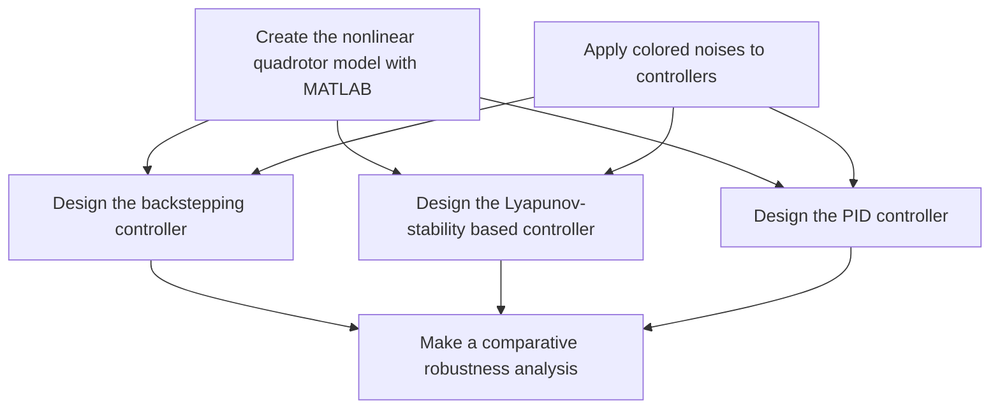

• Firstly, a nonlinear model of the quadrotor UAV was created with MATLAB/Simulink software.   
• Secondly, a robust backstepping controller was designed to control the altitude and attitude of this nonlinear quadrotor model. A classical PID controller design and a Lyapunov-based controller design were also used to perform a comparative robustness analysis with the backstepping controller.   
• Thirdly, these controllers were tested under band-limited Gaussian white, pink, brown, blue, and purple noises. The controllers’ overshoot, rise time, and settling time values under these noises were acquired, and a comparative robustness analysis was performed.

The obtained results demonstrated the robustness of the backstepping controller. A Pseudocode briefly explaining the work done is shown in Fig. 2.

flowchart

Figure 2: Pseudocode of the work
