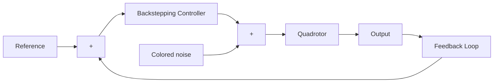

# 5 Simulations

In this section, reference tracking simulations were performed under white Gaussian noise, pink noise, brown noise, blue noise, and purple noise. Simulations were made using the MATLAB program. The block diagram of the designed system is given in Fig. 5. $\varphi _ { d } , \theta _ { d } , \psi _ { a }$ d are reference trajectories, and $\varphi _ { d } ,$ , $\theta _ { d } , \psi _ { d }$ are output trajectories of the system. Colored noise is added to the output of the backstepping controller. Within the scope of the study, the proposed backstepping controller was compared with the classical PID controller and the Lyapunov-based controller. For this purpose, the rise time, overshoot, and settling time data of all three controllers were compared. The obtained results prove the robustness of the backstepping controller.

flowchart

Figure 5: Block diagram of the designed system
