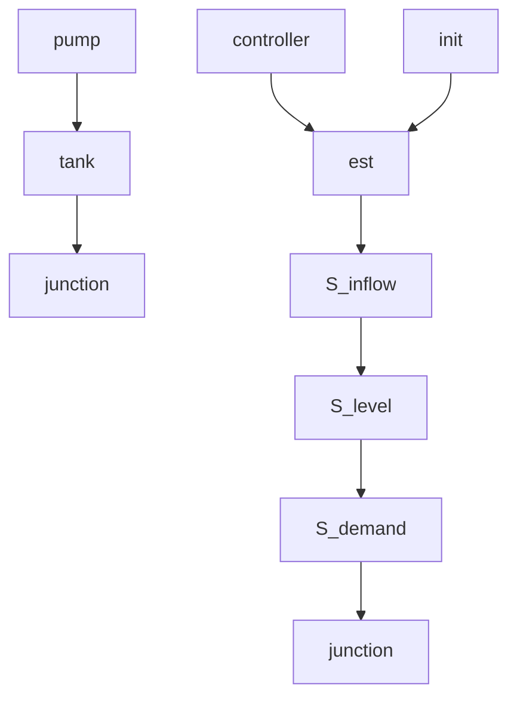

# C. The iCPS-DL: Enabling an Autonomic Supervisor

The Industrial Cyber-Physical System Description Language (iCPS-DL) was developed using the ANTLR4 parser generator and the Go programming language. The language supports user-defined industrial domains, agent repositories, and industrial processes. It also supports the functionalities of the semantic reasoning engine, as shown by the grammar:

```txt
command : domain | repository | process
| translate | traverse | configure | ...

domain : 'domain' '{' domain_decl* '}'
domain_decl : property | model | class | translation

repository : 'repository' ID '{' rep_decl+ '}'
rep_decl : 'estimate' ID 'using' ID '=' local
| 'sense' ID 'using' ID '=' local
| 'control' ID 'using' ID '=' local
| 'actuate' ID 'using' ID '=' local

process : PROCESS ID '{' process_decl* '}'
process_decl : device | component | connection_decl 
```

The iCPS-DL GitHub repository and CodeOcean module implement a proof of concept autonomic supervisor, with basic implementations for the event manager and the control loop configuration deployment module, that uses the iCPS-DL to control a simulation of the paper’s examples. Users can also use the terminal for demonstration purposes, manually defining structures and applying the iCPS-DL functionalities, or to load script files containing iCPS-DL commands.

Currently, the iCPS-DL does not support functionalities for the control loop configuration deployment module. Implementing such functionalities is an important future direction. It could include extending the semantics of iCPS-DL to implement a programming language based on interaction semantics and implementing network communication libraries and tools for remote programming of CPS components. Moreover, a possible implementation of the event manager could incorporate fault detection algorithms, security incident detection, and manual and automatic component update detection.


<details>
<summary>flowchart</summary>


</details>

Fig. 2. The drinking water distribution network consists of a pump, a tank, and a junction where water is consumed. Three sensors monitor the tank inflow, tank water level, and actual water demand, along with a controller for the pump actuator. Each sensor agent communicates and exchanges information with other CPS components.
