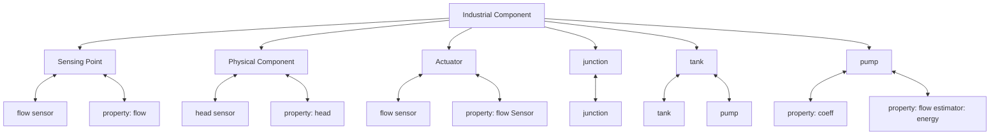

# B. Autonomic supervision for the running example

This section demonstrates the autonomic reconfiguration the running example in response to events. Additionally, the CodeOcean repository provides a proof-of-concept autonomic supervisor that reconfigures a simulation of the running example, ensuring control despite consecutive failures.

Fig. 5 (top) depicts the knowledge graph of the running example in Section IV-D extended with additional sensing points. The corresponding iCPS-DL description is defined as:

```txt
simple := process wdn {
    device dev1, dev2, dev3
    physical r, d demand
    physical j junction
    physical p1, p2 pipe
    physical t tank
    actuator u@dev1 pump
    sensor s1@dev1, s3@dev1, s6@dev2 head
    sensor s2@dev1, s4@dev1, s5@dev2, s7@dev2, s8@dev3 flow
    conn j1->u, u->j2, j2->p1, p1->t, t->p2, p2->j3, j1->s1,
    u->s2, j2->s3, j2->s4, p1->s5, t->s6, p2->s7, j3->s8
} 
```  
Listing 1. iCPS-DL description of the running example. Shaded elements are affected in case of device dev2 failure.

The process specifies the wdn industrial domain. It includes three hardware devices dev1, dev2, and dev3. The system features two demand points r and d, a junction j, two pipes p1 and p2, a tank t, and a pump actuator u controlled by device dev1. Additionally, three head sensors and five flow sensors are deployed at their corresponding sensing devices. The process also defines the interconnections between components.


<details>
<summary>flowchart</summary>


</details>

Fig. 4. Class diagram of the Water Distribution Network domain together with iCPS-DL description of the agent repository.


<details>
<summary>flowchart</summary>
