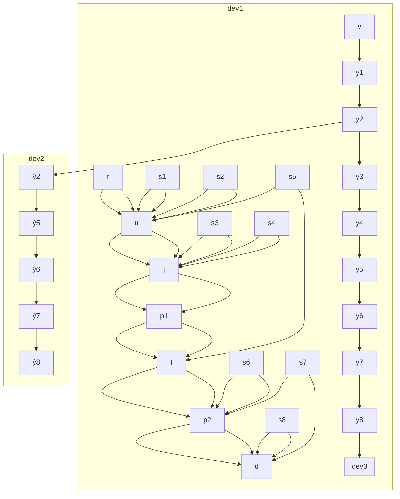

</details>

Fig. 5. Top: Graphical representation of the running example in Section IV-D. Middle: Graphical representation of the state estimation graph. Bottom: Graphical representation of the seven estimation trees rooted at tank.head, with a hardware device assignment for each node.

The following iCPS-DL code:

```txt
seg := translate simple
trees := traverse t.head seg
lconfig := configure trees[1] agents controller u
gconfig := compose lconfig 
```

Listing 2. Semantic Reasoning using iCPS-DL

translates process simple into the corresponding state estimation graph, seq, depicted in Fig. 5 (middle). Each physical component is translated into the state (pentagon shapes) and estimator nodes (square shapes) as defined by its class. The translation function then interconnects state nodes, estimator nodes, and sensing points (triangle shapes). It then identifies a forest of estimation trees, rooted at node t.head, by traversing state estimation graph seg. Fig. 5 (bottom) presents an overlay of the seven identified estimation trees. Each tree details an estimation or measurement of the t.head property. Blue and red highlight the estimation trees corresponding to the two control schemes described in Section IV-D. The diagram also maps tree nodes to hardware devices. Assuming that trees [1] accesses the red estimation tree, the next command uses the agent repository agents to produce local configuration lconfig from Fig. 3. The last command composes global protocol gconfig validating that lconfig is live. The control loop configuration deployment module will generate and deploy within the iCPS network the agents corresponding to lconfig.
