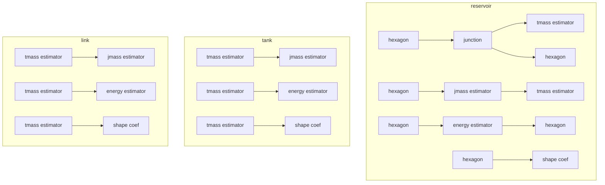

The state estimation translation function: i) translates each physical component, $v \in V$ , into a state estimation subgraph expressing state estimation within the component class; ii) uses the information from industrial process graph edges $( v _ { 1 } , v _ { 2 } ) \in$ E , to interlink these subgraphs, forming a comprehensive state estimation graph.

The state estimation translation function operates as follows: It maps each physical component $v \in V$ into a state estimation subgraph. This subgraph represents state estimation within the corresponding component class. Information from the industrial process graph edges $( v _ { 1 } , v _ { 2 } ) \ \in \ E$ interlinks these subgraphs, creating a comprehensive state estimation graph. Fig. 6 shows the physical component classes with their attributes and the translation of each class in the water distribution network into its internal subgraph.

flowchart

Fig. 6. Analytical redundancy subgraphs for the Water Distribution Network ontology. Pentagon shapes represent state nodes, and square shapes represent estimator nodes.
