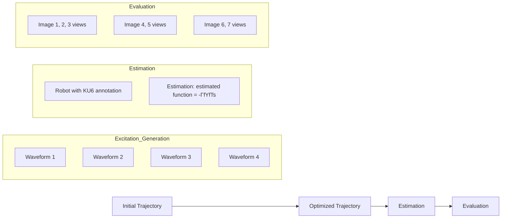

# Adaptive Control based Friction Estimation for Tracking Control of Robot Manipulators

Junning Huang1, Davide Tateo1, Puze Liu1,2, Jan Peters1,2,3

flowchart

Fig. 1: Proposed pipeline for friction estimation and evaluation: (Left) we start by generating excitation by solving an optimization problem with random initial trajectories; (Center) an adaptive controller is then proposed to estimate the friction parameters with the excitation we generated from the previous step; (Right) the estimated parameters are evaluated on two trajectory tracking tasks: joint space random Fourier trajectories and cartesian space drawing tasks.
