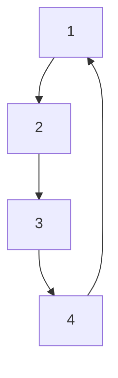
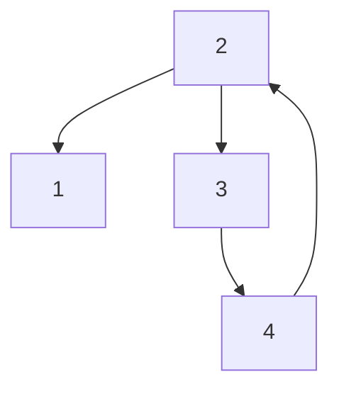

$$V _ {S 2} (t) = \| (\mathcal {D} ^ {\top} \otimes I _ {n}) x \| _ {1} = \frac {1}{2} \sum_ {i = 1} ^ {n} \sum_ {j \in \mathcal {N} _ {i}} \| x _ {i} - x _ {j} \| _ {1}. \tag {25}$$

In other words, for $V _ { S 2 } ( t )$ to be zero, every pair of connected nodes $( i , j ) \in \mathcal { E }$ must have matching positions $( x _ { i } ( t ) = x _ { j } ( t ) )$ at time $t , \ \mathrm { A s }$ a result, $V _ { S 2 } ( t )$ will converge to zero in a finite time, and the convergence time is smaller than the initial value of $V _ { S 2 } ( 0 ) / \epsilon$ . Furthermore, as $V _ { S 2 } ( t )$ approaches zero, $\| x _ { i } - x _ { j } \| _ { 1 } \to 0$ for all $i \in \mathcal V$ and $j \in \mathcal { N } _ { i }$ . Given that our network is connected and undirected, this condition ensures that all agents will achieve a consensus in a finite time. Specifically, there will come a moment, denoted as $T _ { 2 }$ such that $\begin{array} { r } { \| { x } _ { i } ( t ) - \frac { 1 } { N } \sum _ { j = 1 } ^ { N } { x } _ { j } ( t ) \| _ { 2 } = 0 } \end{array}$ for all $i \in \mathcal V$ and for all $t > T _ { 2 }$ .

Therefore, for $t \geq T _ { 2 }$ , the states of the system can achieve consensus, i.e., $x _ { i } ( t ) = x _ { j } ( t ) , \forall i , j \in \mathcal { V }$ and the system (17) is transformed to

$$\dot {x} _ {i} (t) = - \left(\nabla^ {2} \tilde {L} _ {i} (x _ {i}, t)\right) ^ {- 1} \left(\nabla \tilde {L} _ {i} (x _ {i}, t) + \frac {\partial}{\partial t} \nabla \tilde {L} _ {i} (x _ {i}, t)\right) \tag {26}$$

Define the following Lyapunov function candidate as

$$V _ {S 3} (t) = \frac {1}{2} \left(\sum_ {i = 1} ^ {N} \nabla \tilde {L} _ {i} (x _ {i}, t)\right) ^ {\top} \left(\sum_ {i = 1} ^ {N} \nabla \tilde {L} _ {i} (x _ {i}, t)\right). \tag {27}$$

Taking the derivative of $V _ { S 3 } ( t )$ with respect to the system described in (26) results in

$$\dot {V} _ {S 3} (t) = \sum_ {i = 1} ^ {N} \nabla \tilde {L} _ {i} (x _ {i}, t) ^ {\top} \times \left(\sum_ {i = 1} ^ {N} \nabla^ {2} \tilde {L} _ {i} (x _ {i}, t) \dot {x} _ {i} + \sum_ {i = 1} ^ {N} \frac {\partial}{\partial t} \nabla \tilde {L} _ {i} (x _ {i}, t)\right) \tag {28}$$

Then by substituting (26) into (28), we have

$$\dot {V} _ {S 3} (t) = - \left(\sum_ {i = 1} ^ {N} \nabla \tilde {L} _ {i} (x _ {i}, t)\right) ^ {\top} \left(\sum_ {i = 1} ^ {N} \nabla \tilde {L} _ {i} (x _ {i}, t)\right) = - 2 V _ {S 3} \leq 0. \tag {29}$$

flowchart

(a) Undirected connected graph

flowchart

(b) Undirected less connected graph   
Fig. 1. Network topology of four agents

which indicates that $V _ { S 3 } ( t ) = e ^ { - 2 t } V _ { S 3 } ( 0 )$ for all $t \geq 0$ . It can be concluded that $V _ { S 3 } ( t )$ exponentially converges to zero, and thus, $\textstyle \sum _ { i = 1 } ^ { N } \nabla \tilde { L } _ { i } ( x _ { i } , t )$ exponentially converges to 0.
