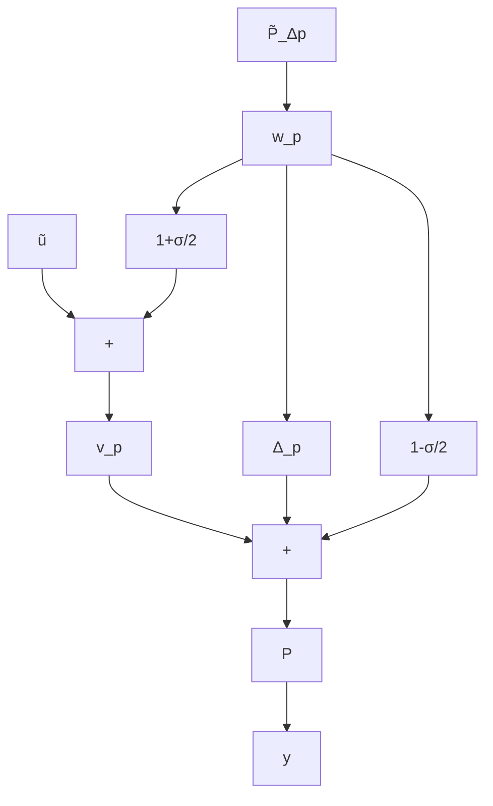

# II. BACKGROUND AND PROBLEM SETUP

We consider the problem of robustly stabilizing a plant using a neural network controller, with the further objective of maximizing a reward. We first describe the plant uncertainty and neural network, and then give the problem formulation.

flowchart

Fig. 1. Block-diagram of disk margin uncertainty at plant input.
