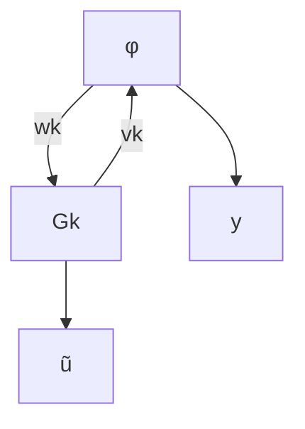

This interpretation allows us to broaden the disk margin to non-LTI uncertainty by generalizing $\Delta _ { p }$ to be $\mathcal { L } _ { 2 }$ normbounded by α. The class of plants which must be stabilized is then $\mathcal { M } _ { \alpha } = \{ \tilde { P } _ { \Delta _ { p } } \ | \ \mathcal { L } _ { 2 }$ gain of $\Delta _ { p } { \mathrm { \ i s \ } } < \alpha \}$ . In the rest of this paper, we say that a controller satisfies the disk margin $D ( \alpha , \sigma )$ if it stabilizes the class of plants $\mathcal { M } _ { \alpha }$ .

flowchart

Fig. 2. The neural network controller is modeled as the interconnection of an LTI system $G _ { k }$ and activation functions ϕ.
