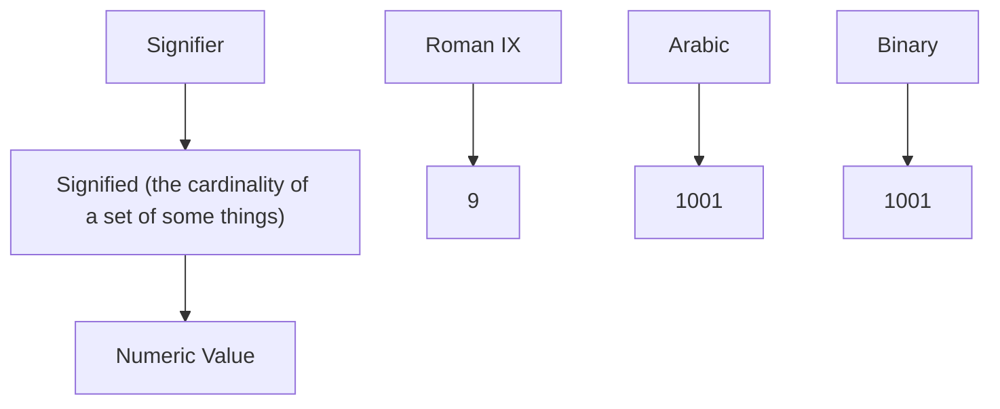

flowchart

Fig. 1: Numeric value of a literal

To get an understanding of the significance of a numeric value of the CS in the PS, we need an explanation that grounds the numeric value in the real world by providing a measurement unit and a meaningful property name of an entity in the PS.

In the physical world, a measurement consists of a numeric value complemented by the applicable measurement unit, called the dimension of the value. The dimension explains the value by denoting an agreed measurement system, e.g., the international SI system. A bare numeric value, without an identification of the dimension, is of no use in the PS. Care must be taken when performing arithmetic operations on the numerical values of measurements. The addition and subtraction of numerical values are only permitted if the measurements have the same dimension, which will also be the dimension of the result. The multiplication or division of numerical values that have different dimensions result in a new value with a new dimension.

3) Natural language word as Signifier: The meaning of a natural language word is the acquired concept, i.e., the unit of thought, that is associated with the word in the conceptual landscape, the mind, of the language user. The issue of concept formation, i.e., how a word acquires its meaning, is discussed in [4, pp.17-20].

Let us look at the following example where two static data items are linked by the predicate is:
