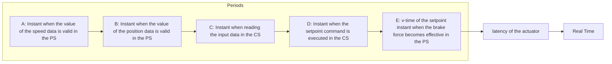

In many CPS applications this simplifying assumption of zero latency of the sensors and actuators cannot me made, because the latency of a sensor at the interface between the PS and the CS or the latency of the actuator at the interface between the CS and the PS is significant in relation to the dynamics of the physical process. Fig. 4 depicts the full picture, where all latencies of the sensors and actuators are considered.

The notion of sensor latency refers to the duration between the instants when an acquired input value is TRUE in the PS (instants A and B in Fig. 4) and the instant when these values are offered for reading in the CS (instant C in Fig. 4). In a time-triggered system, a sensor value is offered to the software in the CS at the SOF. It is good practice that the software module that deals with a sensor transforms the bitpattern acquired from the sensor to standardized engineering units also performs an extrapolation from the instants when the values of the sensors are TRUE in the PS (instants A and B in Fig. 4) to the value that is TRUE at the SOF (instant C in Fig. 4).

flowchart

Fig. 4: Timing with sensor and actuator latencies

The notion of actuator latency refers to the duration between the instants when the output command with the setpoint value is executed in the CS and the instant when this output command becomes active in the PS (interval between instants D and E in Fig. 4). Given that this actuator latency is known a priori, the extrapolation of the sensor values to the v-time of the output command (instant E in Fig. 4) can be performed in the software module that calculates the setpoint value.
