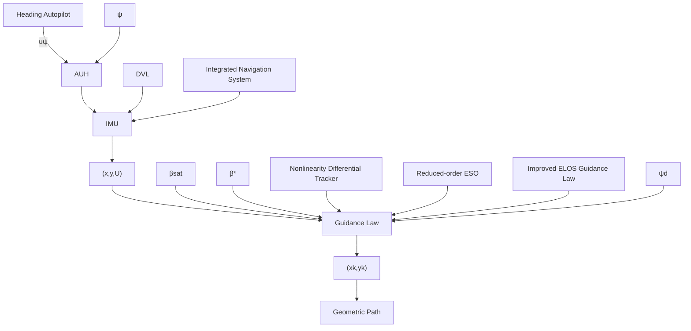

# 2.2. Tracking-Error Equations

The path-tangential coordinate system can be obtained by rotating the North-East coordinate system {??} and angle ?? about the downward $z _ { n } \mathrm { - a x i s } .$ , as shown in Figure 1. The along-track and cross-track errors $( x _ { e } , y _ { e } )$ expressed in {??} are given by

$$
\left[ \begin{array}{l} x _ {e} \\ y _ {e} \end{array} \right] = \left[ \begin{array}{c c} \cos \alpha_ {k} & \sin \alpha_ {k} \\ - \sin \alpha_ {k} & \cos \alpha_ {k} \end{array} \right] \left[ \begin{array}{l} x - x _ {k} (w) \\ y - y _ {k} (w) \end{array} \right] \tag {2}
$$

where $\left( x _ { k } \left( w \right) , y _ { k } \left( w \right) \right)$ denotes the desired geometric path and ?? represents the path variable. The path-tangential angle is given by $\alpha _ { k } ( w ) = \dim 2 ( y ^ { \prime } { } _ { k } ( w ) , x ^ { \prime } { } _ { k } ( w ) )$ , where $x ^ { \prime } { } _ { k } ( w ) =$ $\frac { \partial x _ { k } } { \partial w }$ , and $\begin{array} { r } { y { ' } _ { k } ( w ) = \frac { \partial y _ { k } } { \partial w } } \end{array}$ .

???? Then taking the time derivative of $x _ { e }$ and $y _ { e }$

$$
\left\{ \begin{array}{c} \dot {x} _ {e} = \dot {x} \cos \alpha_ {k} + \dot {y} \sin \alpha_ {k} - \dot {x} _ {k} (w) \cos \alpha_ {k} - \dot {y} _ {k} (w) \sin \alpha_ {k} \\ + \dot {\alpha} _ {k} [ - (x - x _ {k} (w)) \cdot \sin \alpha_ {k} + (y - y _ {k} (w)) \cdot \cos \alpha_ {k} ] \\ \dot {y} _ {e} = - \dot {x} \sin \alpha_ {k} + \dot {y} \cos \alpha_ {k} + \dot {x} _ {k} (w) \sin \alpha_ {k} - \dot {y} _ {k} (w) \cos \alpha_ {k} \\ - \dot {\alpha} _ {k} [ - (x - x _ {k} (w)) \cdot \cos \alpha_ {k} + (y - y _ {k} (w)) \cdot \sin \alpha_ {k} ] \end{array} \right. \tag {3}
$$

Define $U = \sqrt { u ^ { 2 } + v ^ { 2 } } > 0$ as the projected velocity of the AUH on the horizontal plane. $\beta = \mathrm { a t a n } 2 ( v , u )$ represents the sideslip angle,and the $u _ { p }$ is the speed of the virtual reference point expressed by

flowchart

Figure 2: Diagram of the IELOS
